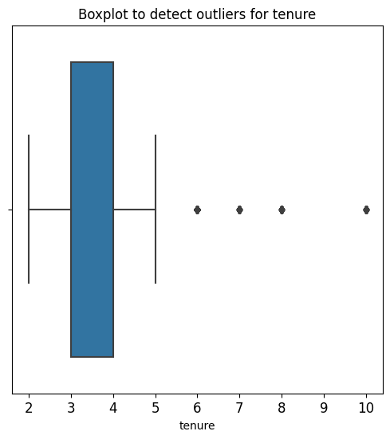

## Google Advanced Data Analytics Capstone
## Table of Contents
- [Introduction](#Salifort-Motors-Employee-Retention-Project)
    - [About the Company](#About-the-Company)
    - [Business Scenario and Problem](#Business-Scenario-and-Problem)
    - [Data Dictionary](#Data-Dictionary)
- [Import and Load Dataset](#Import-and-Load-Dataset)
- [Exploratory Data Analysis (EDA) and Data Cleaning](#Exploratory-Data-Analysis-(EDA)-and-Aata-Cleaning)
    - [Basic information and descriptive statistics](#Basic-information-and-descriptive-statistics)
    - [Rename columns and identify missing and duplicated values](#Rename-columns-and-identify-missing-and-duplicated-values)
    - [Check outliers](#Check-outliers)  

#### Salifort Motors Employee Retention Project
##### **About the Company**
Salifort Motors is a fictional French-based alternative energy vehicle manufacturer. Its global workforce of over 100,000 employees research, design, construct, validate, and distribute electric, solar, algae, and hydrogen-based vehicles. Salifort’s end-to-end vertical integration model has made it a global leader at the intersection of alternative energy and automobiles.  

##### **Business Scenario and Problem**  
The HR department at Salifort Motors wants to take some initiatives to improve employee satisfaction levels at the company. They collected data from employees, and now they like to provide data-driven suggestions based on analysis of the data. They have the following question: what’s likely to make the employee leave the company?  
The goals in this project are to analyze the data collected by the HR department and to build a model that predicts whether or not an employee will leave the company.  
If the model can predict employees likely to quit, it might be possible to identify factors that contribute to their leaving. Because it is time-consuming and expensive to find, interview, and hire new employees, increasing employee retention will be beneficial to the company.

##### **Data Dictionary**
The [dataset](https://drive.google.com/drive/folders/1gvylI3XqpDFPW0I4zSJbKZmVhJ-ycHQY?usp=sharing) contain 10 columns and 14,999 rows - each row is a different employee’s self-reported information.

| Column Name | Type| Description |
| :--- | :---| :---|
| satisfaction_level | int64 | The employee’s self-reported satisfaction level [0-1] |
| last_evaluation | int64 | Score of employee's last performance review [0–1] |
| number_project | int64 | Number of projects employee contributes to |
| average_monthly_hours | int64 | Average number of hours employee worked per month |
| time_spend_company | int64 | How long the employee has been with the company (years) |
| work_accident | int64 | Whether or not the employee experienced an accident while at work |
| left| int64 | Whether or not the employee left the company |
| promotion_last_5years | int64 | Whether or not the employee was promoted in the last 5 years |
| department | str | The employee's department |
| salary | str | The employee's salary (low, medium, or high) |

##### **Import and Load Dataset**


```python
# Data manipulation
import numpy as np
import pandas as pd

# Data visualization
import matplotlib.pyplot as plt
import seaborn as sns

# Data modeling
from xgboost import XGBClassifier
from xgboost import XGBRegressor
from xgboost import plot_importance
from sklearn.linear_model import LogisticRegression
from sklearn.tree import DecisionTreeClassifier
from sklearn.ensemble import RandomForestClassifier

# Model evaluation and decision tree visualization
from sklearn.model_selection import GridSearchCV, train_test_split
from sklearn.metrics import accuracy_score, precision_score, recall_score,\
f1_score, confusion_matrix, ConfusionMatrixDisplay, classification_report
from sklearn.metrics import roc_auc_score, roc_curve
from sklearn.tree import plot_tree

# Save models
import pickle

# Handle HTTP requests and input/output operations
import requests
from io import StringIO

# Display all of the columns in dataframes
pd.set_option('display.max_columns', None)

raw_url = 'https://raw.githubusercontent.com/pouriaetab/pouriaetab.github.io/main/data/HR_comma_sep.csv'
# Download the content
response = requests.get(raw_url)
data = StringIO(response.text)
# Read the CSV into a DataFrame
df0 = pd.read_csv(data)
df0.head().style.set_table_styles([
    {'selector': 'table', 'props': [('max-width', '80%')]}
])
```


<style type="text/css">
#T_907cd table {
  max-width: 80%;
}
</style>
<table id="T_907cd">
  <thead>
    <tr>
      <th class="blank level0" >&nbsp;</th>
      <th id="T_907cd_level0_col0" class="col_heading level0 col0" >satisfaction_level</th>
      <th id="T_907cd_level0_col1" class="col_heading level0 col1" >last_evaluation</th>
      <th id="T_907cd_level0_col2" class="col_heading level0 col2" >number_project</th>
      <th id="T_907cd_level0_col3" class="col_heading level0 col3" >average_montly_hours</th>
      <th id="T_907cd_level0_col4" class="col_heading level0 col4" >time_spend_company</th>
      <th id="T_907cd_level0_col5" class="col_heading level0 col5" >Work_accident</th>
      <th id="T_907cd_level0_col6" class="col_heading level0 col6" >left</th>
      <th id="T_907cd_level0_col7" class="col_heading level0 col7" >promotion_last_5years</th>
      <th id="T_907cd_level0_col8" class="col_heading level0 col8" >Department</th>
      <th id="T_907cd_level0_col9" class="col_heading level0 col9" >salary</th>
    </tr>
  </thead>
  <tbody>
    <tr>
      <th id="T_907cd_level0_row0" class="row_heading level0 row0" >0</th>
      <td id="T_907cd_row0_col0" class="data row0 col0" >0.380000</td>
      <td id="T_907cd_row0_col1" class="data row0 col1" >0.530000</td>
      <td id="T_907cd_row0_col2" class="data row0 col2" >2</td>
      <td id="T_907cd_row0_col3" class="data row0 col3" >157</td>
      <td id="T_907cd_row0_col4" class="data row0 col4" >3</td>
      <td id="T_907cd_row0_col5" class="data row0 col5" >0</td>
      <td id="T_907cd_row0_col6" class="data row0 col6" >1</td>
      <td id="T_907cd_row0_col7" class="data row0 col7" >0</td>
      <td id="T_907cd_row0_col8" class="data row0 col8" >sales</td>
      <td id="T_907cd_row0_col9" class="data row0 col9" >low</td>
    </tr>
    <tr>
      <th id="T_907cd_level0_row1" class="row_heading level0 row1" >1</th>
      <td id="T_907cd_row1_col0" class="data row1 col0" >0.800000</td>
      <td id="T_907cd_row1_col1" class="data row1 col1" >0.860000</td>
      <td id="T_907cd_row1_col2" class="data row1 col2" >5</td>
      <td id="T_907cd_row1_col3" class="data row1 col3" >262</td>
      <td id="T_907cd_row1_col4" class="data row1 col4" >6</td>
      <td id="T_907cd_row1_col5" class="data row1 col5" >0</td>
      <td id="T_907cd_row1_col6" class="data row1 col6" >1</td>
      <td id="T_907cd_row1_col7" class="data row1 col7" >0</td>
      <td id="T_907cd_row1_col8" class="data row1 col8" >sales</td>
      <td id="T_907cd_row1_col9" class="data row1 col9" >medium</td>
    </tr>
    <tr>
      <th id="T_907cd_level0_row2" class="row_heading level0 row2" >2</th>
      <td id="T_907cd_row2_col0" class="data row2 col0" >0.110000</td>
      <td id="T_907cd_row2_col1" class="data row2 col1" >0.880000</td>
      <td id="T_907cd_row2_col2" class="data row2 col2" >7</td>
      <td id="T_907cd_row2_col3" class="data row2 col3" >272</td>
      <td id="T_907cd_row2_col4" class="data row2 col4" >4</td>
      <td id="T_907cd_row2_col5" class="data row2 col5" >0</td>
      <td id="T_907cd_row2_col6" class="data row2 col6" >1</td>
      <td id="T_907cd_row2_col7" class="data row2 col7" >0</td>
      <td id="T_907cd_row2_col8" class="data row2 col8" >sales</td>
      <td id="T_907cd_row2_col9" class="data row2 col9" >medium</td>
    </tr>
    <tr>
      <th id="T_907cd_level0_row3" class="row_heading level0 row3" >3</th>
      <td id="T_907cd_row3_col0" class="data row3 col0" >0.720000</td>
      <td id="T_907cd_row3_col1" class="data row3 col1" >0.870000</td>
      <td id="T_907cd_row3_col2" class="data row3 col2" >5</td>
      <td id="T_907cd_row3_col3" class="data row3 col3" >223</td>
      <td id="T_907cd_row3_col4" class="data row3 col4" >5</td>
      <td id="T_907cd_row3_col5" class="data row3 col5" >0</td>
      <td id="T_907cd_row3_col6" class="data row3 col6" >1</td>
      <td id="T_907cd_row3_col7" class="data row3 col7" >0</td>
      <td id="T_907cd_row3_col8" class="data row3 col8" >sales</td>
      <td id="T_907cd_row3_col9" class="data row3 col9" >low</td>
    </tr>
    <tr>
      <th id="T_907cd_level0_row4" class="row_heading level0 row4" >4</th>
      <td id="T_907cd_row4_col0" class="data row4 col0" >0.370000</td>
      <td id="T_907cd_row4_col1" class="data row4 col1" >0.520000</td>
      <td id="T_907cd_row4_col2" class="data row4 col2" >2</td>
      <td id="T_907cd_row4_col3" class="data row4 col3" >159</td>
      <td id="T_907cd_row4_col4" class="data row4 col4" >3</td>
      <td id="T_907cd_row4_col5" class="data row4 col5" >0</td>
      <td id="T_907cd_row4_col6" class="data row4 col6" >1</td>
      <td id="T_907cd_row4_col7" class="data row4 col7" >0</td>
      <td id="T_907cd_row4_col8" class="data row4 col8" >sales</td>
      <td id="T_907cd_row4_col9" class="data row4 col9" >low</td>
    </tr>
  </tbody>
</table>


##### **Exploratory Data Analysis (EDA) and Data Cleaning**

###### **Basic information and descriptive statistics**


```python
# Basic information about the data 
df0.info()
# Descriptive statistics about the data
df0.describe()
```

    <class 'pandas.core.frame.DataFrame'>
    RangeIndex: 14999 entries, 0 to 14998
    Data columns (total 10 columns):
     #   Column                 Non-Null Count  Dtype  
    ---  ------                 --------------  -----  
     0   satisfaction_level     14999 non-null  float64
     1   last_evaluation        14999 non-null  float64
     2   number_project         14999 non-null  int64  
     3   average_montly_hours   14999 non-null  int64  
     4   time_spend_company     14999 non-null  int64  
     5   Work_accident          14999 non-null  int64  
     6   left                   14999 non-null  int64  
     7   promotion_last_5years  14999 non-null  int64  
     8   Department             14999 non-null  object 
     9   salary                 14999 non-null  object 
    dtypes: float64(2), int64(6), object(2)
    memory usage: 1.1+ MB


<div>
<style scoped>
    .dataframe tbody tr th:only-of-type {
        vertical-align: middle;
    }

    .dataframe tbody tr th {
        vertical-align: top;
    }

    .dataframe thead th {
        text-align: right;
    }
</style>
<table border="1" class="dataframe">
  <thead>
    <tr style="text-align: right;">
      <th></th>
      <th>satisfaction_level</th>
      <th>last_evaluation</th>
      <th>number_project</th>
      <th>average_montly_hours</th>
      <th>time_spend_company</th>
      <th>Work_accident</th>
      <th>left</th>
      <th>promotion_last_5years</th>
    </tr>
  </thead>
  <tbody>
    <tr>
      <th>count</th>
      <td>14999.000000</td>
      <td>14999.000000</td>
      <td>14999.000000</td>
      <td>14999.000000</td>
      <td>14999.000000</td>
      <td>14999.000000</td>
      <td>14999.000000</td>
      <td>14999.000000</td>
    </tr>
    <tr>
      <th>mean</th>
      <td>0.612834</td>
      <td>0.716102</td>
      <td>3.803054</td>
      <td>201.050337</td>
      <td>3.498233</td>
      <td>0.144610</td>
      <td>0.238083</td>
      <td>0.021268</td>
    </tr>
    <tr>
      <th>std</th>
      <td>0.248631</td>
      <td>0.171169</td>
      <td>1.232592</td>
      <td>49.943099</td>
      <td>1.460136</td>
      <td>0.351719</td>
      <td>0.425924</td>
      <td>0.144281</td>
    </tr>
    <tr>
      <th>min</th>
      <td>0.090000</td>
      <td>0.360000</td>
      <td>2.000000</td>
      <td>96.000000</td>
      <td>2.000000</td>
      <td>0.000000</td>
      <td>0.000000</td>
      <td>0.000000</td>
    </tr>
    <tr>
      <th>25%</th>
      <td>0.440000</td>
      <td>0.560000</td>
      <td>3.000000</td>
      <td>156.000000</td>
      <td>3.000000</td>
      <td>0.000000</td>
      <td>0.000000</td>
      <td>0.000000</td>
    </tr>
    <tr>
      <th>50%</th>
      <td>0.640000</td>
      <td>0.720000</td>
      <td>4.000000</td>
      <td>200.000000</td>
      <td>3.000000</td>
      <td>0.000000</td>
      <td>0.000000</td>
      <td>0.000000</td>
    </tr>
    <tr>
      <th>75%</th>
      <td>0.820000</td>
      <td>0.870000</td>
      <td>5.000000</td>
      <td>245.000000</td>
      <td>4.000000</td>
      <td>0.000000</td>
      <td>0.000000</td>
      <td>0.000000</td>
    </tr>
    <tr>
      <th>max</th>
      <td>1.000000</td>
      <td>1.000000</td>
      <td>7.000000</td>
      <td>310.000000</td>
      <td>10.000000</td>
      <td>1.000000</td>
      <td>1.000000</td>
      <td>1.000000</td>
    </tr>
  </tbody>
</table>
</div>


###### **Rename columns and identify missing and duplicated values**


```python
# Rename columns as needed
df0 = df0.rename(columns={'Work_accident': 'work_accident',
                          'average_montly_hours': 'average_monthly_hours',
                          'time_spend_company': 'tenure',
                          'Department': 'department',
                          'number_project' : 'total_projects'})
# Check for missing values helper function
def null_columns(df):
    """
    Display columns with missing values in a user-friendly format.

    Parameters:
    - df: pandas DataFrame

    Returns:
    None
    """
    # Columns with missing values
    null_cols = df.columns[df.isna().sum() > 0]

    # Display user-friendly message
    if len(null_cols) > 0:
        print("Columns with missing values:")
        for col in null_cols:
            print(f"- {col}")
    else:
        print("No columns with missing values.")
null_columns(df0)
```

    No columns with missing values.


```python
def duplicate_percentage(df):
    """
    Print the percentage of duplicated rows in a DataFrame.

    Parameters:
    - df: pandas DataFrame

    Returns:
    None
    """
    dup_sum = df.duplicated().sum()
    dup_pct = (dup_sum / len(df)) * 100
    print(f"Total duplicated rows: {dup_sum: .2f}. \nPercentage of duplicated rows: {dup_pct: .2f}%")
duplicate_percentage(df0)
```

    Total duplicated rows:  3008.00. 
    Percentage of duplicated rows:  20.05%


Performing a likelihood analysis using Bayes' Theorem to calculate the conditional probabilities for each value in each column before dropping the duplicated rows.


```python
def likelihood_analysis(df, target_col):
    """
    Perform likelihood analysis using Bayes' theorem.

    Parameters:
    - df: pandas DataFrame
    - target_col: str, the column for which likelihood analysis is performed

    Returns:
    - likelihood_df: pandas DataFrame, showing the conditional probabilities
    """
    # Create an empty DataFrame to store conditional probabilities
    likelihood_df = pd.DataFrame(index=df.columns, columns=df[target_col].unique())

    for col in df.columns:
        col_values = []
        for value in df[target_col].unique():
            # Calculate the conditional probability of observing 'value' given target_col, P(value | target_col)
            subset = df[df[target_col] == value][col]
            if not subset.empty:
                likelihood = subset.value_counts() / len(subset)
                col_values.append(likelihood.get(1, 0))  # Binary classification (1 is when employee has left)
            else:
                col_values.append(0)  # Handle division by zero

        likelihood_df.loc[col, :] = col_values

    likelihood_df = likelihood_df.fillna(0)  # Handle NaN values

    return likelihood_df

# Target colum is 'left'
result = likelihood_analysis(df0, 'left')
result
```


<div>
<style scoped>
    .dataframe tbody tr th:only-of-type {
        vertical-align: middle;
    }

    .dataframe tbody tr th {
        vertical-align: top;
    }

    .dataframe thead th {
        text-align: right;
    }
</style>
<table border="1" class="dataframe">
  <thead>
    <tr style="text-align: right;">
      <th></th>
      <th>1</th>
      <th>0</th>
    </tr>
  </thead>
  <tbody>
    <tr>
      <th>satisfaction_level</th>
      <td>0.000000</td>
      <td>0.009713</td>
    </tr>
    <tr>
      <th>last_evaluation</th>
      <td>0.046766</td>
      <td>0.010151</td>
    </tr>
    <tr>
      <th>total_projects</th>
      <td>0.000000</td>
      <td>0.000000</td>
    </tr>
    <tr>
      <th>average_monthly_hours</th>
      <td>0.000000</td>
      <td>0.000000</td>
    </tr>
    <tr>
      <th>tenure</th>
      <td>0.000000</td>
      <td>0.000000</td>
    </tr>
    <tr>
      <th>work_accident</th>
      <td>0.047326</td>
      <td>0.175009</td>
    </tr>
    <tr>
      <th>left</th>
      <td>1.000000</td>
      <td>0.000000</td>
    </tr>
    <tr>
      <th>promotion_last_5years</th>
      <td>0.005321</td>
      <td>0.026251</td>
    </tr>
    <tr>
      <th>department</th>
      <td>0.195183</td>
      <td>0.177021</td>
    </tr>
    <tr>
      <th>salary</th>
      <td>0.368804</td>
      <td>0.448810</td>
    </tr>
  </tbody>
</table>
</div>


In the context of this problem, the presence of duplicated rows for some employees is considered an error. The likelihood analysis indicates no high conditional probabilities that significantly differ for the 'left' feature being 1 and 0. Therefore, dropping duplicated rows is unlikely to result in the loss of meaningful information. While the likelihood analysis may not have been strictly necessary due to the presence of several continuous variables across columns, it serves as an additional indicator that these duplicated observations are very unlikely to be legitimate. The likelihood analysis function, however, remains a valuable tool for potential use in future projects.


```python
# Drop duplicates and save resulting dataframe in a new variable
df1 = df0.drop_duplicates(keep='first')
duplicate_percentage(df1)
```

    Total duplicated rows:  0.00. 
    Percentage of duplicated rows:  0.00%


###### **Check outliers**


```python
def create_static_boxplots(df):
    """
    Create static boxplots for non-binary and non-object features.

    Parameters:
    - df: pandas DataFrame

    Returns:
    - None (displays the plots)
    """
    # Get non-object columns
    numeric_columns = df.select_dtypes(['float64', 'int64']).columns

    # Count the number of binary features
    num_binary_features = sum(df[col].nunique() <= 2 for col in numeric_columns)

    # Count the number of object/str features
    num_object_features = sum(df[col].dtype == 'object' for col in df.columns)

    # Define an accessible color palette
    colors = sns.color_palette("colorblind")

    # Filter out binary features
    non_binary_columns = [col for col in numeric_columns if df[col].nunique() > 2]

    # Create subplots with two boxplots per row (handle odd number of boxplots)
    num_plots = len(non_binary_columns)
    num_rows = num_plots // 2 + num_plots % 2
    fig, axes = plt.subplots(num_rows, 2, figsize=(12, 4 * num_rows))
    fig.suptitle("Boxplots for Numeric Features", y=1.02)

    # Remove unnecessary empty subplot if the number of boxplots is odd
    if num_plots % 2 != 0:
        fig.delaxes(axes[-1, -1])

    row, col = 0, 0

    for col_name, color in zip(non_binary_columns, colors):
        sns.boxplot(x=df[col_name], ax=axes[row, col], color=color)
        axes[row, col].set_title(col_name)
        col += 1
        if col > 1:
            col = 0
            row += 1

    plt.tight_layout()
    plt.show()
create_static_boxplots(df1)

```


    

    


```python

```


```python

```


```python

```


```python


# # Check outliers
# # Create a boxplot to visualize distribution of `tenure` and detect any outliers
# plt.figure(figsize=(6,6))
# plt.title('Boxplot to detect outliers for tenure', fontsize=12)
# plt.xticks(fontsize=12)
# plt.yticks(fontsize=12)
# sns.boxplot(x=df1['tenure'])
# plt.show()
# # Determine the number of rows containing outliers 
# # Compute the 25th percentile value in `tenure`
# percentile25 = df1['tenure'].quantile(0.25)
# # Compute the 75th percentile value in `tenure`
# percentile75 = df1['tenure'].quantile(0.75)
# # Compute the interquartile range in `tenure`
# iqr = percentile75 - percentile25
# # Define the upper limit and lower limit for non-outlier values in `tenure`
# upper_limit = percentile75 + 1.5 * iqr
# lower_limit = percentile25 - 1.5 * iqr
# print("Lower limit:", lower_limit)
# print("Upper limit:", upper_limit)
# # Identify subset of data containing outliers in `tenure`
# outliers = df1[(df1['tenure'] > upper_limit) | (df1['tenure'] < lower_limit)]
# # Count how many rows in the data contain outliers in `tenure`
# print("Number of rows in the data containing outliers in `tenure`:", len(outliers))
# # pAce: Analyze Stage
# ## Step 2. Data Exploration (Continue EDA)
# # Get numbers of people who left vs. stayed
# print(df1['left'].value_counts())
# print()
# # Get percentages of people who left vs. stayed
# print(df1['left'].value_counts(normalize=True))
# # Data visualizations
# # Create a plot as needed 
# # Set figure and axes
# fig, ax = plt.subplots(1, 2, figsize = (22,8))
# # Create boxplot showing `average_monthly_hours` distributions for `number_project`, comparing employees who stayed versus those who left
# sns.boxplot(data=df1, x='average_monthly_hours', y='number_project', hue='left', orient="h", ax=ax[0])
# ax[0].invert_yaxis()
# ax[0].set_title('Monthly hours by number of projects', fontsize='14')
# # Create histogram showing distribution of `number_project`, comparing employees who stayed versus those who left
# tenure_stay = df1[df1['left']==0]['number_project']
# tenure_left = df1[df1['left']==1]['number_project']
# sns.histplot(data=df1, x='number_project', hue='left', multiple='dodge', shrink=2, ax=ax[1])
# ax[1].set_title('Number of projects histogram', fontsize='14')
# # Display the plots
# plt.show()
# # Get value counts of stayed/left for employees with 7 projects
# df1[df1['number_project']==7]['left'].value_counts()
# # Create a plot as needed 
# # Create scatterplot of `average_monthly_hours` versus `satisfaction_level`, comparing employees who stayed versus those who left
# plt.figure(figsize=(16, 9))
# sns.scatterplot(data=df1, x='average_monthly_hours', y='satisfaction_level', hue='left', alpha=0.4)
# plt.axvline(x=166.67, color='#ff6361', label='166.67 hrs./mo.', ls='--')
# plt.legend(labels=['166.67 hrs./mo.', 'left', 'stayed'])
# plt.title('Monthly hours by last evaluation score', fontsize='14');
# # Create a plot as needed 
# # Set figure and axes
# fig, ax = plt.subplots(1, 2, figsize = (22,8))
# # Create boxplot showing distributions of `satisfaction_level` by tenure, comparing employees who stayed versus those who left
# sns.boxplot(data=df1, x='satisfaction_level', y='tenure', hue='left', orient="h", ax=ax[0])
# ax[0].invert_yaxis()
# ax[0].set_title('Satisfaction by tenure', fontsize='14')
# # Create histogram showing distribution of `tenure`, comparing employees who stayed versus those who left
# tenure_stay = df1[df1['left']==0]['tenure']
# tenure_left = df1[df1['left']==1]['tenure']
# sns.histplot(data=df1, x='tenure', hue='left', multiple='dodge', shrink=5, ax=ax[1])
# ax[1].set_title('Tenure histogram', fontsize='14')
# plt.show();
# # Calculate mean and median satisfaction scores of employees who left and those who stayed
# df1.groupby(['left'])['satisfaction_level'].agg([np.mean,np.median])
# # Create a plot as needed 
# # Set figure and axes
# fig, ax = plt.subplots(1, 2, figsize = (22,8))
# # Define short-tenured employees
# tenure_short = df1[df1['tenure'] < 7]
# # Define long-tenured employees
# tenure_long = df1[df1['tenure'] > 6]
# # Plot short-tenured histogram
# sns.histplot(data=tenure_short, x='tenure', hue='salary', discrete=1, 
#              hue_order=['low', 'medium', 'high'], multiple='dodge', shrink=.5, ax=ax[0])
# ax[0].set_title('Salary histogram by tenure: short-tenured people', fontsize='14')
# # Plot long-tenured histogram
# sns.histplot(data=tenure_long, x='tenure', hue='salary', discrete=1, 
#              hue_order=['low', 'medium', 'high'], multiple='dodge', shrink=.4, ax=ax[1])
# ax[1].set_title('Salary histogram by tenure: long-tenured people', fontsize='14');
# # Create a plot as needed 
# # Create scatterplot of `average_monthly_hours` versus `last_evaluation`
# plt.figure(figsize=(16, 9))
# sns.scatterplot(data=df1, x='average_monthly_hours', y='last_evaluation', hue='left', alpha=0.4)
# plt.axvline(x=166.67, color='#ff6361', label='166.67 hrs./mo.', ls='--')
# plt.legend(labels=['166.67 hrs./mo.', 'left', 'stayed'])
# plt.title('Monthly hours by last evaluation score', fontsize='14');
# # Create a plot as needed 
# # Create plot to examine relationship between `average_monthly_hours` and `promotion_last_5years`
# plt.figure(figsize=(16, 3))
# sns.scatterplot(data=df1, x='average_monthly_hours', y='promotion_last_5years', hue='left', alpha=0.4)
# plt.axvline(x=166.67, color='#ff6361', ls='--')
# plt.legend(labels=['166.67 hrs./mo.', 'left', 'stayed'])
# plt.title('Monthly hours by promotion last 5 years', fontsize='14');
# # Display counts for each department
# df1["department"].value_counts()
# # Create a plot as needed 
# # Create stacked histogram to compare department distribution of employees who left to that of employees who didn't
# plt.figure(figsize=(11,8))
# sns.histplot(data=df1, x='department', hue='left', discrete=1, 
#              hue_order=[0, 1], multiple='dodge', shrink=.5)
# plt.xticks(rotation='45')
# plt.title('Counts of stayed/left by department', fontsize=14);
# # Create a plot as needed 
# # Plot a correlation heatmap
# plt.figure(figsize=(16, 9))
# heatmap = sns.heatmap(df0.corr(), vmin=-1, vmax=1, annot=True, cmap=sns.color_palette("vlag", as_cmap=True))
# heatmap.set_title('Correlation Heatmap', fontdict={'fontsize':14}, pad=12);
# # paCe: Construct Stage
# ## Step 3. Model Building, Step 4. Results and Evaluation

# # Modeling Approach A: Logistic Regression Model
# # Logistic regression
# # Copy the dataframe
# df_enc = df1.copy()
# # Encode the `salary` column as an ordinal numeric category
# df_enc['salary'] = (
#     df_enc['salary'].astype('category')
#     .cat.set_categories(['low', 'medium', 'high'])
#     .cat.codes
# )
# # Dummy encode the `department` column
# df_enc = pd.get_dummies(df_enc, drop_first=False)
# # Display the new dataframe
# df_enc.head()
# # Create a heatmap to visualize how correlated variables are
# plt.figure(figsize=(8, 6))
# sns.heatmap(df_enc[['satisfaction_level', 'last_evaluation', 'number_project', 'average_monthly_hours', 'tenure']]
#             .corr(), annot=True, cmap="crest")
# plt.title('Heatmap of the dataset')
# plt.show()
# # Create a stacked bart plot to visualize number of employees across department, comparing those who left with those who didn't
# # In the legend, 0 (purple color) represents employees who did not leave, 1 (red color) represents employees who left
# pd.crosstab(df1['department'], df1['left']).plot(kind ='bar',color='mr')
# plt.title('Counts of employees who left versus stayed across department')
# plt.ylabel('Employee count')
# plt.xlabel('Department')
# plt.show()
# # Select rows without outliers in `tenure` and save resulting dataframe in a new variable
# df_logreg = df_enc[(df_enc['tenure'] >= lower_limit) & (df_enc['tenure'] <= upper_limit)]
# # Display first few rows of new dataframe
# df_logreg.head()
# # Isolate the outcome variable
# y = df_logreg['left']
# # Display first few rows of the outcome variable
# y.head() 
# # Select the features you want to use in your model
# X = df_logreg.drop('left', axis=1)
# # Display the first few rows of the selected features 
# X.head()
# # Split the data into training set and testing set
# X_train, X_test, y_train, y_test = train_test_split(X, y, test_size=0.25, stratify=y, random_state=42)
# # Construct a logistic regression model and fit it to the training dataset
# log_clf = LogisticRegression(random_state=42, max_iter=500).fit(X_train, y_train)
# # Use the logistic regression model to get predictions on the test set
# y_pred = log_clf.predict(X_test)
# # Compute values for confusion matrix
# log_cm = confusion_matrix(y_test, y_pred, labels=log_clf.classes_)
# # Create display of confusion matrix
# log_disp = ConfusionMatrixDisplay(confusion_matrix=log_cm, 
#                                   display_labels=log_clf.classes_)
# # Plot confusion matrix
# log_disp.plot(values_format='')
# # Display plot
# plt.show()
# df_logreg['left'].value_counts(normalize=True)
# # Create classification report for logistic regression model
# target_names = ['Predicted would not leave', 'Predicted would leave']
# print(classification_report(y_test, y_pred, target_names=target_names))
# # Create classification report for logistic regression model
# target_names = ['Predicted would not leave', 'Predicted would leave']
# print(classification_report(y_test, y_pred, target_names=target_names))

# # Modeling Approach B: Tree-based Model
# # Isolate the outcome variable
# y = df_enc['left']
# # Display the first few rows of `y`
# y.head()
# # Select the features
# X = df_enc.drop('left', axis=1)
# # Display the first few rows of `X`
# X.head()
# # Split the data
# X_train, X_test, y_train, y_test = train_test_split(X, y, test_size=0.25, stratify=y, random_state=0)
# # Decision tree - Round 1
# # Instantiate model
# tree = DecisionTreeClassifier(random_state=0)
# # Assign a dictionary of hyperparameters to search over
# cv_params = {'max_depth':[4, 6, 8, None],
#              'min_samples_leaf': [2, 5, 1],
#              'min_samples_split': [2, 4, 6]
#              }
# # Assign a dictionary of scoring metrics to capture
# scoring = {'accuracy', 'precision', 'recall', 'f1', 'roc_auc'}
# # Instantiate GridSearch
# tree1 = GridSearchCV(tree, cv_params, scoring=scoring, cv=4, refit='roc_auc')
# %%time
# tree1.fit(X_train, y_train)
# # Check best parameters
# tree1.best_params_
# # Check best AUC score on CV
# tree1.best_score_
# def make_results(model_name:str, model_object, metric:str):
#     '''
#     Arguments:
#         model_name (string): what you want the model to be called in the output table
#         model_object: a fit GridSearchCV object
#         metric (string): precision, recall, f1, accuracy, or auc
  
#     Returns a pandas df with the F1, recall, precision, accuracy, and auc scores
#     for the model with the best mean 'metric' score across all validation folds.  
#     '''
#     # Create dictionary that maps input metric to actual metric name in GridSearchCV
#     metric_dict = {'auc': 'mean_test_roc_auc',
#                    'precision': 'mean_test_precision',
#                    'recall': 'mean_test_recall',
#                    'f1': 'mean_test_f1',
#                    'accuracy': 'mean_test_accuracy'
#                   }
#     # Get all the results from the CV and put them in a df
#     cv_results = pd.DataFrame(model_object.cv_results_)
#     # Isolate the row of the df with the max(metric) score
#     best_estimator_results = cv_results.iloc[cv_results[metric_dict[metric]].idxmax(), :]
#     # Extract Accuracy, precision, recall, and f1 score from that row
#     auc = best_estimator_results.mean_test_roc_auc
#     f1 = best_estimator_results.mean_test_f1
#     recall = best_estimator_results.mean_test_recall
#     precision = best_estimator_results.mean_test_precision
#     accuracy = best_estimator_results.mean_test_accuracy
#     # Create table of results
#     table = pd.DataFrame()
#     table = pd.DataFrame({'model': [model_name],
#                           'precision': [precision],
#                           'recall': [recall],
#                           'F1': [f1],
#                           'accuracy': [accuracy],
#                           'auc': [auc]
#                         })
#     return table
# # Random forest - Round 1
# # Get all CV scores
# tree1_cv_results = make_results('decision tree cv', tree1, 'auc')
# tree1_cv_results
# # Instantiate model
# rf = RandomForestClassifier(random_state=0)
# # Assign a dictionary of hyperparameters to search over
# cv_params = {'max_depth': [3,5, None], 
#              'max_features': [1.0],
#              'max_samples': [0.7, 1.0],
#              'min_samples_leaf': [1,2,3],
#              'min_samples_split': [2,3,4],
#              'n_estimators': [300, 500],
#              }  
# # Assign a dictionary of scoring metrics to capture
# scoring = {'accuracy', 'precision', 'recall', 'f1', 'roc_auc'}
# # Instantiate GridSearch
# rf1 = GridSearchCV(rf, cv_params, scoring=scoring, cv=4, refit='roc_auc')
# %%time
# rf1.fit(X_train, y_train) # --> Wall time: ~10min
# # Define a path to the folder where you want to save the model
# path = '/home/jovyan/work/'
# def write_pickle(path, model_object, save_as:str):
#     '''
#     In: 
#         path:         path of folder where you want to save the pickle
#         model_object: a model you want to pickle
#         save_as:      filename for how you want to save the model

#     Out: A call to pickle the model in the folder indicated
#     '''    

#     with open(path + save_as + '.pickle', 'wb') as to_write:
#         pickle.dump(model_object, to_write)
# def read_pickle(path, saved_model_name:str):
#     '''
#     In: 
#         path:             path to folder where you want to read from
#         saved_model_name: filename of pickled model you want to read in

#     Out: 
#         model: the pickled model 
#     '''
#     with open(path + saved_model_name + '.pickle', 'rb') as to_read:
#         model = pickle.load(to_read)

#     return model
# # Write pickle
# write_pickle(path, rf1, 'hr_rf1')
# # Read pickle
# rf1 = read_pickle(path, 'hr_rf1')
# # Check best AUC score on CV
# rf1.best_score_
# # Check best params
# rf1.best_params_
# # Get all CV scores
# rf1_cv_results = make_results('random forest cv', rf1, 'auc')
# print(tree1_cv_results)
# print(rf1_cv_results)
# def get_scores(model_name:str, model, X_test_data, y_test_data):
#     '''
#     Generate a table of test scores.
#     In: 
#         model_name (string):  How you want your model to be named in the output table
#         model:                A fit GridSearchCV object
#         X_test_data:          numpy array of X_test data
#         y_test_data:          numpy array of y_test data
#     Out: pandas df of precision, recall, f1, accuracy, and AUC scores for your model
#     '''
#     preds = model.best_estimator_.predict(X_test_data)
#     auc = roc_auc_score(y_test_data, preds)
#     accuracy = accuracy_score(y_test_data, preds)
#     precision = precision_score(y_test_data, preds)
#     recall = recall_score(y_test_data, preds)
#     f1 = f1_score(y_test_data, preds)
#     table = pd.DataFrame({'model': [model_name],
#                           'precision': [precision], 
#                           'recall': [recall],
#                           'f1': [f1],
#                           'accuracy': [accuracy],
#                           'AUC': [auc]
#                          })
#     return table
# # Get predictions on test data
# rf1_test_scores = get_scores('random forest1 test', rf1, X_test, y_test)
# rf1_test_scores
# # Feature Engineering
# # Drop `satisfaction_level` and save resulting dataframe in new variable
# df2 = df_enc.drop('satisfaction_level', axis=1)
# # Display first few rows of new dataframe
# df2.head()
# # Create `overworked` column. For now, it's identical to average monthly hours.
# df2['overworked'] = df2['average_monthly_hours']
# # Inspect max and min average monthly hours values
# print('Max hours:', df2['overworked'].max())
# print('Min hours:', df2['overworked'].min())
# # Define `overworked` as working > 175 hrs/week
# df2['overworked'] = (df2['overworked'] > 175).astype(int)
# # Display first few rows of new column
# df2['overworked'].head()
# # Drop the `average_monthly_hours` column
# df2 = df2.drop('average_monthly_hours', axis=1)
# # Display first few rows of resulting dataframe
# df2.head()
# # Isolate the outcome variable
# y = df2['left']
# # Select the features
# X = df2.drop('left', axis=1)
# # Create test data
# X_train, X_test, y_train, y_test = train_test_split(X, y, test_size=0.25, stratify=y, random_state=0)
# # Decision tree - Round 2
# # Instantiate model
# tree = DecisionTreeClassifier(random_state=0)
# # Assign a dictionary of hyperparameters to search over
# cv_params = {'max_depth':[4, 6, 8, None],
#              'min_samples_leaf': [2, 5, 1],
#              'min_samples_split': [2, 4, 6]
#              }
# # Assign a dictionary of scoring metrics to capture
# scoring = {'accuracy', 'precision', 'recall', 'f1', 'roc_auc'}
# # Instantiate GridSearch
# tree2 = GridSearchCV(tree, cv_params, scoring=scoring, cv=4, refit='roc_auc')
# %%time
# tree2.fit(X_train, y_train)
# # Check best params
# tree2.best_params_
# # Check best AUC score on CV
# tree2.best_score_
# # Get all CV scores
# tree2_cv_results = make_results('decision tree2 cv', tree2, 'auc')
# print(tree1_cv_results)
# print(tree2_cv_results)
# # Random forest - Round 2
# # Instantiate model
# rf = RandomForestClassifier(random_state=0)
# # Assign a dictionary of hyperparameters to search over
# cv_params = {'max_depth': [3,5, None], 
#              'max_features': [1.0],
#              'max_samples': [0.7, 1.0],
#              'min_samples_leaf': [1,2,3],
#              'min_samples_split': [2,3,4],
#              'n_estimators': [300, 500],
#              }  
# # Assign a dictionary of scoring metrics to capture
# scoring = {'accuracy', 'precision', 'recall', 'f1', 'roc_auc'}
# # Instantiate GridSearch
# rf2 = GridSearchCV(rf, cv_params, scoring=scoring, cv=4, refit='roc_auc')
# %%time
# rf2.fit(X_train, y_train) # --> Wall time: 7min 5s
# # Write pickle
# write_pickle(path, rf2, 'hr_rf2')
# # Read in pickle
# rf2 = read_pickle(path, 'hr_rf2')
# # Check best params
# rf2.best_params_
# # Check best AUC score on CV
# rf2.best_score_
# # Get all CV scores
# rf2_cv_results = make_results('random forest2 cv', rf2, 'auc')
# print(tree2_cv_results)
# print(rf2_cv_results)
# # Get predictions on test data
# rf2_test_scores = get_scores('random forest2 test', rf2, X_test, y_test)
# rf2_test_scores
# # Generate array of values for confusion matrix
# preds = rf2.best_estimator_.predict(X_test)
# cm = confusion_matrix(y_test, preds, labels=rf2.classes_)
# # Plot confusion matrix
# disp = ConfusionMatrixDisplay(confusion_matrix=cm,
#                              display_labels=rf2.classes_)
# disp.plot(values_format='');
# # Decision tree splits
# # Plot the tree
# plt.figure(figsize=(85,20))
# plot_tree(tree2.best_estimator_, max_depth=6, fontsize=14, feature_names=X.columns, 
#           class_names={0:'stayed', 1:'left'}, filled=True);
# plt.show()
# # Decision tree feature importance
# #tree2_importances = pd.DataFrame(tree2.best_estimator_.feature_importances_, columns=X.columns)
# tree2_importances = pd.DataFrame(tree2.best_estimator_.feature_importances_, 
#                                  columns=['gini_importance'], 
#                                  index=X.columns
#                                 )
# tree2_importances = tree2_importances.sort_values(by='gini_importance', ascending=False)
# # Only extract the features with importances > 0
# tree2_importances = tree2_importances[tree2_importances['gini_importance'] != 0]
# tree2_importances
# sns.barplot(data=tree2_importances, x="gini_importance", y=tree2_importances.index, orient='h')
# plt.title("Decision Tree: Feature Importances for Employee Leaving", fontsize=12)
# plt.ylabel("Feature")
# plt.xlabel("Importance")
# plt.show()
# # Random forest feature importance
# # Get feature importances
# feat_impt = rf2.best_estimator_.feature_importances_
# # Get indices of top 10 features
# ind = np.argpartition(rf2.best_estimator_.feature_importances_, -10)[-10:]
# # Get column labels of top 10 features 
# feat = X.columns[ind]
# # Filter `feat_impt` to consist of top 10 feature importances
# feat_impt = feat_impt[ind]
# y_df = pd.DataFrame({"Feature":feat,"Importance":feat_impt})
# y_sort_df = y_df.sort_values("Importance")
# fig = plt.figure()
# ax1 = fig.add_subplot(111)
# y_sort_df.plot(kind='barh',ax=ax1,x="Feature",y="Importance")
# ax1.set_title("Random Forest: Feature Importances for Employee Leaving", fontsize=12)
# ax1.set_ylabel("Feature")
# ax1.set_xlabel("Importance")
# plt.show()
```


```python

```


```python

```


```python

```


```python

```


```python

```


```python

```
