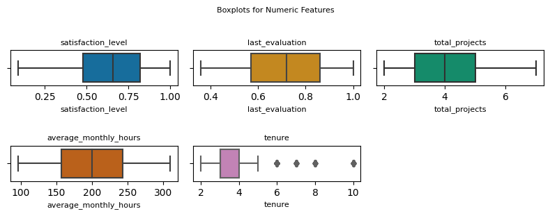
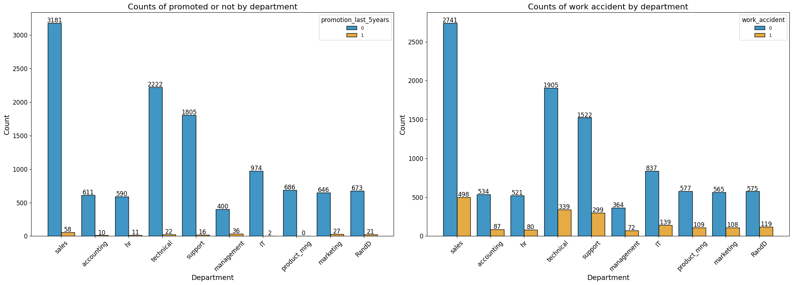

## Google Advanced Data Analytics Capstone  
<!-- jupyter nbconvert --to markdown README.ipynb -->
## Table of Contents  

* TOC
{:toc}  

#### Salifort Motors Employee Retention Project
##### **About the Project**

This dataset was exclusively utilized for the Google Advanced Data Analytics capstone project, not featured in preceding courses. My objective is to demonstrate my passion for data analysis, showcasing a penchant for uncovering insights and innovating within the data realm. This curiosity extends to diverse data types. When faced with unfamiliar subject matter, my strength lies in self-education—immersing myself in academic papers, video trainings, original source documents, and reading related books. I've refrained from presenting all my codes here to maintain brevity, but behind each stated number or percentage there is a detailed code.

This portfolio project aims to offer partial insight into my thought process when working with a dataset. Additionally, I am committed to continuous improvement; while this project is considered complete today, I acknowledge its potential enhancement. I am open to summarizing it into an executive page to highlight key points as needed. I look forward to the prospect of discussing or collaborating with you on exciting projects. 

##### **About the Company** 
Salifort Motors is a fictional French-based alternative energy vehicle manufacturer. Its global workforce of over 100,000 employees research, design, construct, validate, and distribute electric, solar, algae, and hydrogen-based vehicles. Salifort’s end-to-end vertical integration model has made it a global leader at the intersection of alternative energy and automobiles.  

##### **Business Scenario and Problem**  
The HR department at Salifort Motors wants to take some initiatives to improve employee satisfaction levels at the company. They collected data from employees, and now they like to provide data-driven suggestions based on analysis of the data. They have the following question: what’s likely to make the employee leave the company? Currently, about 16.60% of the employees have left the company totalling 1991 employees. Additionally, about 71.02% of employees that have left the company have satisfaction level of 0.5. or below. Currently, 19.70% of current employees that haven't left the company have 0.5 or below on their satisfaction level rating, this translates to 1970 employees.
The goals in this project are to analyze the data collected by the HR department and to build a model that predicts whether or not an employee will leave the company.  
If the model can predict employees likely to quit, it might be possible to identify factors that contribute to their leaving. Because it is time-consuming and expensive to find, interview, and hire new employees, increasing employee retention will be beneficial to the company.

##### **Data Dictionary**
The [dataset](https://drive.google.com/drive/folders/1gvylI3XqpDFPW0I4zSJbKZmVhJ-ycHQY?usp=sharing) contain 10 columns and 14,999 rows - each row is a different employee’s self-reported information.

| Column Name | Type| Description |
| :--- | :---| :---|
| satisfaction_level | int64 | The employee’s self-reported satisfaction level [0-1] |
| last_evaluation | int64 | Score of employee's last performance review [0–1] |
| number_project | int64 | Number of projects employee contributes to |
| average_monthly_hours | int64 | Average number of hours employee worked per month |
| time_spend_company | int64 | How long the employee has been with the company (years) |
| work_accident | int64 | Whether the employee had a work accident (1) or not (0) |
| left| int64 | Whether the employee left the company (1) or not (0) |
| promotion_last_5years | int64 | Whether the employee was promoted in the last 5 years (1) or not (0) |
| department | str | The employee's department |
| salary | str | The employee's salary (e.g., low, medium, or high) |

##### **Import and Load Dataset**


```python
# Data manipulation
import numpy as np
import pandas as pd

# Data visualization
import matplotlib.pyplot as plt
import seaborn as sns

# Data modeling
from xgboost import XGBClassifier
from xgboost import XGBRegressor
from xgboost import plot_importance
from sklearn.linear_model import LogisticRegression
from sklearn.tree import DecisionTreeClassifier
from sklearn.ensemble import RandomForestClassifier

# Model evaluation and decision tree visualization
from sklearn.model_selection import GridSearchCV, train_test_split
from sklearn.metrics import accuracy_score, precision_score, recall_score,\
f1_score, confusion_matrix, ConfusionMatrixDisplay, classification_report
from sklearn.metrics import roc_auc_score, roc_curve
from sklearn.tree import plot_tree

# Save models
import pickle

# Handle HTTP requests and input/output operations
import requests
from io import StringIO

# Generating cobinations and Cartesian products
from itertools import combinations, product

# Display all of the columns in dataframes
pd.set_option('display.max_columns', None)

raw_url = 'https://raw.githubusercontent.com/pouriaetab/pouriaetab.github.io/main/data/HR_comma_sep.csv'
# Download the content
response = requests.get(raw_url)
data = StringIO(response.text)
# Read the CSV into a DataFrame
df0 = pd.read_csv(data)
df0.head()
```


<div>
<style scoped>
    .dataframe tbody tr th:only-of-type {
        vertical-align: middle;
    }

    .dataframe tbody tr th {
        vertical-align: top;
    }

    .dataframe thead th {
        text-align: right;
    }
</style>
<table border="1" class="dataframe">
  <thead>
    <tr style="text-align: right;">
      <th></th>
      <th>satisfaction_level</th>
      <th>last_evaluation</th>
      <th>number_project</th>
      <th>average_montly_hours</th>
      <th>time_spend_company</th>
      <th>Work_accident</th>
      <th>left</th>
      <th>promotion_last_5years</th>
      <th>Department</th>
      <th>salary</th>
    </tr>
  </thead>
  <tbody>
    <tr>
      <th>0</th>
      <td>0.38</td>
      <td>0.53</td>
      <td>2</td>
      <td>157</td>
      <td>3</td>
      <td>0</td>
      <td>1</td>
      <td>0</td>
      <td>sales</td>
      <td>low</td>
    </tr>
    <tr>
      <th>1</th>
      <td>0.80</td>
      <td>0.86</td>
      <td>5</td>
      <td>262</td>
      <td>6</td>
      <td>0</td>
      <td>1</td>
      <td>0</td>
      <td>sales</td>
      <td>medium</td>
    </tr>
    <tr>
      <th>2</th>
      <td>0.11</td>
      <td>0.88</td>
      <td>7</td>
      <td>272</td>
      <td>4</td>
      <td>0</td>
      <td>1</td>
      <td>0</td>
      <td>sales</td>
      <td>medium</td>
    </tr>
    <tr>
      <th>3</th>
      <td>0.72</td>
      <td>0.87</td>
      <td>5</td>
      <td>223</td>
      <td>5</td>
      <td>0</td>
      <td>1</td>
      <td>0</td>
      <td>sales</td>
      <td>low</td>
    </tr>
    <tr>
      <th>4</th>
      <td>0.37</td>
      <td>0.52</td>
      <td>2</td>
      <td>159</td>
      <td>3</td>
      <td>0</td>
      <td>1</td>
      <td>0</td>
      <td>sales</td>
      <td>low</td>
    </tr>
  </tbody>
</table>
</div>


##### **Exploratory Data Analysis (EDA) and Data Cleaning**

###### **Basic information and descriptive statistics**


```python
# Basic information about the data 
df0.info()
# Descriptive statistics about the data
df0.describe()
```

    <class 'pandas.core.frame.DataFrame'>
    RangeIndex: 14999 entries, 0 to 14998
    Data columns (total 10 columns):
     #   Column                 Non-Null Count  Dtype  
    ---  ------                 --------------  -----  
     0   satisfaction_level     14999 non-null  float64
     1   last_evaluation        14999 non-null  float64
     2   number_project         14999 non-null  int64  
     3   average_montly_hours   14999 non-null  int64  
     4   time_spend_company     14999 non-null  int64  
     5   Work_accident          14999 non-null  int64  
     6   left                   14999 non-null  int64  
     7   promotion_last_5years  14999 non-null  int64  
     8   Department             14999 non-null  object 
     9   salary                 14999 non-null  object 
    dtypes: float64(2), int64(6), object(2)
    memory usage: 1.1+ MB


<div>
<style scoped>
    .dataframe tbody tr th:only-of-type {
        vertical-align: middle;
    }

    .dataframe tbody tr th {
        vertical-align: top;
    }

    .dataframe thead th {
        text-align: right;
    }
</style>
<table border="1" class="dataframe">
  <thead>
    <tr style="text-align: right;">
      <th></th>
      <th>satisfaction_level</th>
      <th>last_evaluation</th>
      <th>number_project</th>
      <th>average_montly_hours</th>
      <th>time_spend_company</th>
      <th>Work_accident</th>
      <th>left</th>
      <th>promotion_last_5years</th>
    </tr>
  </thead>
  <tbody>
    <tr>
      <th>count</th>
      <td>14999.000000</td>
      <td>14999.000000</td>
      <td>14999.000000</td>
      <td>14999.000000</td>
      <td>14999.000000</td>
      <td>14999.000000</td>
      <td>14999.000000</td>
      <td>14999.000000</td>
    </tr>
    <tr>
      <th>mean</th>
      <td>0.612834</td>
      <td>0.716102</td>
      <td>3.803054</td>
      <td>201.050337</td>
      <td>3.498233</td>
      <td>0.144610</td>
      <td>0.238083</td>
      <td>0.021268</td>
    </tr>
    <tr>
      <th>std</th>
      <td>0.248631</td>
      <td>0.171169</td>
      <td>1.232592</td>
      <td>49.943099</td>
      <td>1.460136</td>
      <td>0.351719</td>
      <td>0.425924</td>
      <td>0.144281</td>
    </tr>
    <tr>
      <th>min</th>
      <td>0.090000</td>
      <td>0.360000</td>
      <td>2.000000</td>
      <td>96.000000</td>
      <td>2.000000</td>
      <td>0.000000</td>
      <td>0.000000</td>
      <td>0.000000</td>
    </tr>
    <tr>
      <th>25%</th>
      <td>0.440000</td>
      <td>0.560000</td>
      <td>3.000000</td>
      <td>156.000000</td>
      <td>3.000000</td>
      <td>0.000000</td>
      <td>0.000000</td>
      <td>0.000000</td>
    </tr>
    <tr>
      <th>50%</th>
      <td>0.640000</td>
      <td>0.720000</td>
      <td>4.000000</td>
      <td>200.000000</td>
      <td>3.000000</td>
      <td>0.000000</td>
      <td>0.000000</td>
      <td>0.000000</td>
    </tr>
    <tr>
      <th>75%</th>
      <td>0.820000</td>
      <td>0.870000</td>
      <td>5.000000</td>
      <td>245.000000</td>
      <td>4.000000</td>
      <td>0.000000</td>
      <td>0.000000</td>
      <td>0.000000</td>
    </tr>
    <tr>
      <th>max</th>
      <td>1.000000</td>
      <td>1.000000</td>
      <td>7.000000</td>
      <td>310.000000</td>
      <td>10.000000</td>
      <td>1.000000</td>
      <td>1.000000</td>
      <td>1.000000</td>
    </tr>
  </tbody>
</table>
</div>


###### **Rename columns and identify missing and duplicated values**


```python
# Rename columns as needed
df0 = df0.rename(columns={'Work_accident': 'work_accident',
                          'average_montly_hours': 'average_monthly_hours',
                          'time_spend_company': 'tenure',
                          'Department': 'department',
                          'number_project' : 'total_projects'})
# Check for missing values helper function
def null_columns(df):
    """
    Display columns with missing values in a user-friendly format.

    Parameters:
    - df: pandas DataFrame

    Returns:
    None
    """
    # Columns with missing values
    null_cols = df.columns[df.isna().sum() > 0]

    # Display user-friendly message
    if len(null_cols) > 0:
        print("Columns with missing values:")
        for col in null_cols:
            print(f"- {col}")
    else:
        print("No columns with missing values.")
null_columns(df0)
```

    No columns with missing values.


```python
def duplicate_percentage(df):
    """
    Print the percentage of duplicated rows in a DataFrame.

    Parameters:
    - df: pandas DataFrame

    Returns:
    None
    """
    dup_sum = df.duplicated().sum()
    dup_pct = (dup_sum / len(df)) * 100
    print(f"Total duplicated rows: {dup_sum: .2f}. \nPercentage of duplicated rows: {dup_pct: .2f}%")
duplicate_percentage(df0)
```

    Total duplicated rows:  3008.00. 
    Percentage of duplicated rows:  20.05%


Performing a likelihood analysis using Bayes' Theorem to calculate the conditional probabilities for each value in each column before dropping the duplicated rows.


```python
def likelihood_analysis(df, target_col):
    """
    Perform likelihood analysis using Bayes' theorem.

    Parameters:
    - df: pandas DataFrame
    - target_col: str, the column for which likelihood analysis is performed

    Returns:
    - likelihood_df: pandas DataFrame, showing the conditional probabilities
    """
    # Create an empty DataFrame to store conditional probabilities
    likelihood_df = pd.DataFrame(index=df.columns, columns=df[target_col].unique())

    for col in df.columns:
        col_values = []
        for value in df[target_col].unique():
            # Calculate the conditional probability of observing 'value' given target_col, P(value | target_col)
            subset = df[df[target_col] == value][col]
            if not subset.empty:
                likelihood = subset.value_counts() / len(subset)
                col_values.append(likelihood.get(1, 0))  # Binary classification (1 is when employee has left)
            else:
                col_values.append(0)  # Handle division by zero

        likelihood_df.loc[col, :] = col_values

    likelihood_df = likelihood_df.fillna(0)  # Handle NaN values

    return likelihood_df

# Target colum is 'left'
result = likelihood_analysis(df0, 'left')
result
```


<div>
<style scoped>
    .dataframe tbody tr th:only-of-type {
        vertical-align: middle;
    }

    .dataframe tbody tr th {
        vertical-align: top;
    }

    .dataframe thead th {
        text-align: right;
    }
</style>
<table border="1" class="dataframe">
  <thead>
    <tr style="text-align: right;">
      <th></th>
      <th>1</th>
      <th>0</th>
    </tr>
  </thead>
  <tbody>
    <tr>
      <th>satisfaction_level</th>
      <td>0.000000</td>
      <td>0.009713</td>
    </tr>
    <tr>
      <th>last_evaluation</th>
      <td>0.046766</td>
      <td>0.010151</td>
    </tr>
    <tr>
      <th>total_projects</th>
      <td>0.000000</td>
      <td>0.000000</td>
    </tr>
    <tr>
      <th>average_monthly_hours</th>
      <td>0.000000</td>
      <td>0.000000</td>
    </tr>
    <tr>
      <th>tenure</th>
      <td>0.000000</td>
      <td>0.000000</td>
    </tr>
    <tr>
      <th>work_accident</th>
      <td>0.047326</td>
      <td>0.175009</td>
    </tr>
    <tr>
      <th>left</th>
      <td>1.000000</td>
      <td>0.000000</td>
    </tr>
    <tr>
      <th>promotion_last_5years</th>
      <td>0.005321</td>
      <td>0.026251</td>
    </tr>
    <tr>
      <th>department</th>
      <td>0.195183</td>
      <td>0.177021</td>
    </tr>
    <tr>
      <th>salary</th>
      <td>0.368804</td>
      <td>0.448810</td>
    </tr>
  </tbody>
</table>
</div>


In the context of this problem, the presence of duplicated rows for some employees is considered an error. The likelihood analysis indicates no high conditional probabilities that significantly differ for the 'left' feature being 1 and 0. Therefore, dropping duplicated rows is unlikely to result in the loss of meaningful information. While the likelihood analysis may not have been strictly necessary due to the presence of several continuous variables across columns, it serves as an additional indicator that these duplicated observations are very unlikely to be legitimate. The likelihood analysis function, however, remains a valuable tool for potential use in future projects.


```python
# Drop duplicates and save resulting dataframe in a new variable
df1 = df0.drop_duplicates(keep='first')
duplicate_percentage(df1)
```

    Total duplicated rows:  0.00. 
    Percentage of duplicated rows:  0.00%


###### **Check outliers**


```python
def create_static_boxplots(df):
    """
    Create static boxplots for non-binary and non-object features.

    Parameters:
    - df: pandas DataFrame

    Returns:
    - None (displays the plots)
    """
    # Get non-object columns
    numeric_columns = df.select_dtypes(['float64', 'int64']).columns

    # Count the number of binary features
    num_binary_features = sum(df[col].nunique() <= 2 for col in numeric_columns)

    # Count the number of object/str features
    num_object_features = sum(df[col].dtype == 'object' for col in df.columns)

    # Define an accessible color palette
    colors = sns.color_palette("colorblind")

    # Filter out binary features
    non_binary_columns = [col for col in numeric_columns if df[col].nunique() > 2]

    # Print information about the features
    print(f"Binary Features: {num_binary_features}")
    print(f"Object/Str Features: {num_object_features}")
    print(f"Total Generated Boxplots: {len(non_binary_columns)}")
    
    # Create subplots with two boxplots per row (handle odd number of boxplots)
    num_plots = len(non_binary_columns)
    num_rows = (num_plots + 2) // 3
    fig, axes = plt.subplots(num_rows, 3, figsize=(8, 1.5 * num_rows))
    fig.suptitle("Boxplots for Numeric Features", y=1.02, fontsize=8)

    # Flatten axes array for easier indexing
    axes = axes.flatten()

    # Plot each boxplot
    for idx, col_name in enumerate(non_binary_columns):
        sns.boxplot(x=df[col_name], ax=axes[idx], color=colors[idx % len(colors)])
        axes[idx].set_title(col_name, fontsize=8)
        axes[idx].set_xlabel(col_name,fontsize=8)

    # Remove any unused subplots
    for idx in range(num_plots, len(axes)):
        fig.delaxes(axes[idx])

    plt.tight_layout()
    fig.subplots_adjust(hspace=1.7)
    plt.show()

create_static_boxplots(df1)

```

    Binary Features: 3
    Object/Str Features: 2
    Total Generated Boxplots: 5


    

    


It is evident that the 'tenure' column contains outliers. Subsequently, an investigation will be conducted to determine the number of rows that include outliers in the 'tenure' column.


```python
import pandas as pd

def find_and_display_outliers(df):
    """
    Find and display outliers in non-binary and non-object columns of a DataFrame.

    Parameters:
    - data: pandas DataFrame

    Returns:
    - None (displays information)
    """
    # Select non-binary and non-object columns
    numeric_columns = df.select_dtypes(['float64', 'int64']).columns

    # Filter out binary features
    non_binary_columns = [col for col in numeric_columns if df[col].nunique() > 2]

    for column_name in non_binary_columns:
        # Calculate 25th and 75th percentiles
        q25 = df[column_name].quantile(0.25)
        q75 = df[column_name].quantile(0.75)

        # Calculate interquartile range (IQR)
        iqr = q75 - q25

        # Define lower and upper limits for outliers
        lower_limit = q25 - 1.5 * iqr
        upper_limit = q75 + 1.5 * iqr

        # Identify rows containing outliers
        outliers = df[(df[column_name] < lower_limit) | (df[column_name] > upper_limit)]
        total_outliers = len(outliers)

        # Display information only if outliers are found
        if total_outliers > 0:
            print(f"\nColumn: '{column_name}'")
            print(f"25th Percentile: {q25}")
            print(f"75th Percentile: {q75}")
            print(f"IQR: {iqr}")
            print(f"Lower Limit for Outliers: {lower_limit}")
            print(f"Upper Limit for Outliers: {upper_limit}")
            print(f"Total Rows with Outliers: {total_outliers}")

find_and_display_outliers(df1)

```

    
    Column: 'tenure'
    25th Percentile: 3.0
    75th Percentile: 4.0
    IQR: 1.0
    Lower Limit for Outliers: 1.5
    Upper Limit for Outliers: 5.5
    Total Rows with Outliers: 824


The function provided complements the visual approach for outlier identification through boxplots. It systematically evaluated all non-binary and non-object columns, indicating that 'tenure' is the sole column with outliers, affecting a total of 824 rows in the dataset. This outlier information will play a pivotal role in the decision-making process regarding the choice of a model, as certain models exhibit varying sensitivity to outliers.

###### **Visual data exploration**


```python
plt.figure(figsize=(9, 6))
heatmap = sns.heatmap(df1.corr(numeric_only=True), vmin=-1, vmax=1, annot=True, cmap=sns.color_palette("coolwarm", as_cmap=True), 
                      linewidths=0.5, cbar_kws={"shrink": 0.8},)
plt.xticks(rotation=45, ha='right', fontsize=8)
plt.yticks(fontsize=8)
heatmap.set_title('Correlation Heatmap', fontdict={'fontsize':8}, pad=11)
cbar = heatmap.collections[0].colorbar
cbar.ax.tick_params(labelsize=8)
```


    

    


The correlation heatmap above illustrates positive relationships among the number of projects, monthly hours, and evaluation scores. Additionally, it indicates a negative correlation between employee turnover and satisfaction levels.


```python
def plot_data(df, threshold, target_col, rows_to_display=None):
    """
    Create a set of plots for variable pairs based on correlation and visualize the distribution of data.

    Parameters:
        df (pd.DataFrame): The input DataFrame containing the variables.
        threshold (float): The correlation threshold for selecting variable pairs.
        target_col (str): The target column for hue in boxplots.
        rows_to_display (Optional[Tuple[int, int]]): A tuple specifying the range of rows to display.
            If None, all rows will be displayed. The tuple should be in the format (start_row, end_row),
            where start_row is the index of the first row to display, and end_row is the index of the last row to display.

    Returns:
        None: Displays a set of plots based on the specified parameters.

    Examples:
        # Display all rows
        plot_data(df1, threshold=0.1, target_col='left', rows_to_display=None)

        # Display only the first three rows
        plot_data(df1, threshold=0.1, target_col='left', rows_to_display=(0, 2))

        # Display only the second row
        plot_data(df1, threshold=0.1, target_col='left', rows_to_display=(1, 1))
    """
    # Set the color palette to be visually accessible
    sns.set_palette("colorblind")

    # Create a correlation matrix
    correlation_matrix = df.corr(numeric_only=True)

    # Find the index of the target column
    target_col_index = df.columns.get_loc(target_col)

    # Find variable pairs above the threshold (excluding diagonal and target_col)
    variable_ranges = [(i, j) for i in range(correlation_matrix.shape[0])
                       for j in range(i + 1, correlation_matrix.shape[1])
                       if abs(correlation_matrix.iloc[i, j]) >= threshold
                       and target_col_index not in (i, j)]

    # Print the total number of pair combinations
    print(f"Total plot pair combinations: {len(variable_ranges)}")
    
    # Limit to 10 rows if rows_to_display is not specified
    if rows_to_display is None and len(variable_ranges) > 0:
        rows_to_display = (0, min(10, len(variable_ranges)))
        
    # Filter variable ranges based on rows_to_display
    if rows_to_display:
        display_range = variable_ranges[rows_to_display[0]: rows_to_display[1]]
    else:
        display_range = []

    # Print the number of rows being displayed
    print(f"Number of rows displayed: {len(display_range)}")

    # Identify variables not included in any pairs
    all_vars = set(range(correlation_matrix.shape[0]))
    included_vars = set(var for pair in display_range for var in pair)
    excluded_vars = all_vars - included_vars - {target_col_index}
    excluded_vars_names = [df.columns[i] for i in excluded_vars]
    print("Variables not included in any pairs:", ', '.join([f"'{var}'" for var in excluded_vars_names]))

    # Identify non-numeric variables not included in the correlation matrix
    non_numeric_vars = df.select_dtypes(exclude='number').columns.tolist()
    print("Non-numeric variables not in the correlation matrix:", ', '.join([f"'{var}'" for var in non_numeric_vars]))
    
    # Check if display_range is empty
    if not display_range:
        print("No rows to display.")
        return

    # Create the plots using a loop
    num_rows = len(display_range)
    fig, axes = plt.subplots(num_rows, 2, figsize=(16, 5 * num_rows))
    if num_rows == 1:
        axes = [axes]  # Ensure axes is always a list for consistency
        
    for i, (var1_index, var2_index) in enumerate(display_range):
        var1, var2 = df.columns[var1_index], df.columns[var2_index]
        # Determine x-axis and y-axis variables based on nunique()
        if df[var1].nunique() > 50:
            x_axis_var, y_axis_var = var1, var2
        else:
            x_axis_var, y_axis_var = var2, var1

        # Handle the case when only one row is being displayed
        if num_rows == 1:
            # For a single row, axes[i] becomes a 1D array
            if df[y_axis_var].nunique() > 50:
                # If nunique() is above 50, discretize into 10 ranges and add as y-axis to the boxplot
                y_axis_var_discretized = pd.qcut(df[y_axis_var], q=10)
                sns.boxplot(x=x_axis_var, y=y_axis_var_discretized, hue=target_col, data=df, ax=axes[0], orient="h", 
                            width=0.3, flierprops=dict(markerfacecolor='cyan', markersize=3, marker='o')).tick_params(axis='both', labelsize=7)
            else:
                sns.boxplot(x=x_axis_var, y=y_axis_var, hue=target_col, data=df, ax=axes[0], orient="h", 
                            width=0.3, flierprops=dict(markerfacecolor='cyan', markersize=3, marker='o')).tick_params(axis='both', labelsize=9)
            axes[0].invert_yaxis()
            axes[0].set_title(f'{x_axis_var} by {y_axis_var}', fontsize='11')
            axes[0].set_xlabel(x_axis_var, fontsize=9)
            axes[0].set_ylabel(y_axis_var, fontsize=9)
            axes[0].legend(title=target_col, title_fontsize=9, loc='upper right')
            
            sns.scatterplot(data=df1, x=x_axis_var, y=y_axis_var, hue=target_col, 
                            alpha=0.4, ax=axes[1])
            axes[1].set_title(f'{x_axis_var} by {y_axis_var}', fontsize='11')
            axes[1].set_xlabel(x_axis_var, fontsize=9)
            axes[1].set_ylabel(y_axis_var, fontsize=9)
            axes[1].legend(title=target_col, title_fontsize=9, bbox_to_anchor=(1, 1), loc='upper right')

            # Check if 'average_monthly_hours' is in either x_axis_var or y_axis_var
            if 'average_monthly_hours' in [x_axis_var, y_axis_var]:
                line_color = 'purple'
                # If 'average_monthly_hours' is on x-axis, draw a vertical line at 169.33
                if x_axis_var == 'average_monthly_hours':
                    axes[1].axvline(x=169.33, color=line_color, label='169.33 hrs/mon.', ls='--')
                # If 'average_monthly_hours' is on y-axis, draw a horizontal line at 169.33
                elif y_axis_var == 'average_monthly_hours':
                    axes[1].axhline(y=169.33, color=line_color, label='169.33 hrs/mon.', ls='--')

        else:
            # For multiple rows, continue with the original approach
            if df[y_axis_var].nunique() > 50:
                # If nunique() is above 50, discretize into 10 ranges and add as y-axis to the boxplot
                y_axis_var_discretized = pd.qcut(df[y_axis_var], q=10)
                sns.boxplot(x=x_axis_var, y=y_axis_var_discretized, hue=target_col, data=df, ax=axes[i, 0], orient="h", 
                            width=0.3, flierprops=dict(markerfacecolor='cyan', markersize=3, marker='o')).tick_params(axis='both', labelsize=7)
            else:
                sns.boxplot(x=x_axis_var, y=y_axis_var, hue=target_col, data=df, ax=axes[i, 0], orient="h", 
                            width=0.3, flierprops=dict(markerfacecolor='cyan', markersize=3, marker='o')).tick_params(axis='both', labelsize=9)
            axes[i, 0].invert_yaxis()
            axes[i, 0].set_title(f'{x_axis_var} by {y_axis_var}', fontsize='11')
            axes[i, 0].set_xlabel(x_axis_var, fontsize=9)
            axes[i, 0].set_ylabel(y_axis_var, fontsize=9)
            axes[i, 0].legend(title=target_col, title_fontsize=9, loc='upper right')

            sns.scatterplot(data=df1, x=x_axis_var, y=y_axis_var, hue=target_col, 
                            alpha=0.4, ax=axes[i, 1])
            axes[i, 1].set_title(f'{x_axis_var} by {y_axis_var}', fontsize=12)
            axes[i, 1].set_xlabel(x_axis_var, fontsize=11)
            axes[i, 1].set_ylabel(y_axis_var, fontsize=11)
            axes[i, 1].legend(title=target_col, title_fontsize=9, bbox_to_anchor=(1, 1), loc='upper right')

            # Check if 'average_monthly_hours' is in either x_axis_var or y_axis_var
            if 'average_monthly_hours' in [x_axis_var, y_axis_var]:
                line_color = 'purple'
                # If 'average_monthly_hours' is on x-axis, draw a vertical line at 169.33
                if x_axis_var == 'average_monthly_hours':
                    axes[i, 1].axvline(x=169.33, color=line_color, label='169.33 hrs/mon.', ls='--')
                # If 'average_monthly_hours' is on y-axis, draw a horizontal line at 169.33
                elif y_axis_var == 'average_monthly_hours':
                    axes[i, 1].axhline(y=169.33, color=line_color, label='169.33 hrs/mon.', ls='--')
    # Display the plot                
    plt.tight_layout()
    plt.show()

plot_data(df1, threshold=0.1, target_col='left', rows_to_display=None)
```

    Total plot pair combinations: 7
    Number of rows displayed: 7
    Variables not included in any pairs: 'work_accident', 'promotion_last_5years'
    Non-numeric variables not in the correlation matrix: 'department', 'salary'


    

    


The above boxplots and scatterplots result from a function displaying plots for paired variables based on a correlation score equal to or above a given arbitrary threshold. This threshold is set as an argument to the plot_data function. The purpose of generating these plots simultaneously is to obtain an overview of the features, aiding in the identification of focal features. Key insights from the plots include:  
- Employees with seven total projects have uniformly left the company, with satisfaction levels concentrated below 0.2. Specifically, 135 employees with seven projects submitted the three lowest satisfaction ratings of 0.11, 0.10, and 0.09.  
- Employees with six total projects have the highest departure rate, with 339 employees submitting satisfaction ratings of 0.11, 0.10, and 0.09, all left the company.  
- Deeper analysis reveals that only 1.07% of employees with three projects (38 employees) have left, compared to 100% and 54.17% for employees with seven and two projects, respectively.  
<!--#1-2 -->
- Among employees who left, 94.53% had five or fewer years of tenure. The highest departure rate is among those with 3 years of tenure, with 16.84% (874 employees) left, the highest percentage compared to other tenure groups. No employees left among those with 7, 8, or 10 years of tenure. Additionally, the second-highest number of employees belongs to the 2 years tenure group (2879 employees), with only 31 left, the lowest percentage after the 7, 8, 10 years tenure group.  
<!--#3 -->
- From the boxplot of 'total_projects' and 'last_evaluation' with a 'left' value of 1, the similarity in the interquartile ranges (0.86-0.97 for total projects of 6 and 0.81-0.93 for 5 total projects) suggests that the variability or consistency within these groups is comparable. Therefore, in terms of spread, they are quite similar.  
- In France, the typical workweek is 35 hours per week. However, considering the global nature of the company, it has been decided to focus on an average of 40 hours per week. Additionally, France has eleven national holidays, similar to the U.S. Taking into account the total holidays in a year, I established a regular monthly hours threshold of 169.33 hours. In the boxplot of 'last_evaluation' and 'average_monthly_hours', we observe that the median for obtaining a high evaluation starts to increase from 165-235 hours for employees who have left the company. This suggests potential dissatisfaction with incentives or encouragement to achieve higher monthly work hours. Furthermore, when examining the scatterplot of these variables, it becomes evident that employees who have left the company are primarily concentrated in two areas. The first group consists of those who worked below the 169.33 hours per month threshold and had evaluations between approximately 4.5 to 5.8. The second concentration is among employees who worked above approximately 270 hours monthly, with evaluations ranging from 0.7 to 1.  
- Among employees who have left, those with a 'total_projects' count of 6 and 7 constitute the group that is, as a whole, the most overworked when compared to employees grouped by their total number of projects.  
<!--#4 -->
- The tables below aim to provide additional information about the 'total_projects' and 'tenure' variables. In the right table, it is evident that when 'left' is set to 1, the majority of employees belong to tenures of 3, 4, and 5. This aligns with the observations from the boxplot of 'tenure' by 'total_projects', with 'left' as the hue.  

*Table with 'left' = 1*  

| left | total_projects | total_projects_sum | overall_percentage | percentage_by_left |      |      | left | tenure | tenure_sum | overall_percentage | percentage_by_left |
|------|----------------|--------------------|--------------------|--------------------|------|----- |------|--------|------------|--------------------|--------------------|
| 1    | 2              | 857                | 7.15%              | 43.04%             |      |      |1     | 2      | 31         | 0.26%              | 1.56%              |
| 1    | 3              | 38                 | 0.32%              | 1.91%              |&nbsp;|&nbsp;|1     | **3**  | 874        | 7.29%              | **43.9%**          |
| 1    | 4              | 237                | 1.98%              | 11.9%              |&nbsp;|&nbsp;|1     | **4**  | 495        | 4.13%              | **24.86%**         |
| 1    | 5              | 343                | 2.86%              | 17.23%             |&nbsp;|&nbsp;|1     | **5**  | 482        | 4.02%              | **24.21%**         |
| 1    | 6              | 371                | 3.09%              | 18.63%             |&nbsp;|&nbsp;|1     | 6      | 109        | 0.91%              | 5.47%              |
| 1    | 7              | 145                | 1.21%              | 7.28%              |&nbsp;|&nbsp;|&nbsp;|&nbsp;  |&nbsp;      |&nbsp;              |&nbsp;              |
|&nbsp;|&nbsp;          |&nbsp;              |&nbsp;              |&nbsp;              |&nbsp;|&nbsp;|&nbsp;|&nbsp;  |&nbsp;      |&nbsp;              |&nbsp;              |  


*Table with 'left' = 0*  

| left | total_projects | total_projects_sum | overall_percentage | percentage_by_left |      |      | left | tenure | tenure_sum | overall_percentage | percentage_by_left |
|------|----------------|--------------------|--------------------|--------------------|------|----- |------|--------|------------|--------------------|--------------------|
| 0    | 2              | 725                | 6.05%              | 7.25%              |&nbsp;|&nbsp;|0     | 2      |2879        |24.01%              |28.79%              |
| 0    | 3              | 3482               | 29.04%             | 34.82%             |&nbsp;|&nbsp;|0     | 3      | 4316       | 35.99%             | 43.16%             |
| 0    | 4              | 3448               | 28.75%             | 34.48%             |&nbsp;|&nbsp;|0     | 4      | 1510       | 12.59%             | 15.1%              |
| 0    | 5              | 1890               | 15.76%             | 18.9%              |&nbsp;|&nbsp;|0     | 5      | 580        | 4.84%              | 5.8%               |
| 0    | 6              | 455                | 3.79%              | 4.55%              |&nbsp;|&nbsp;|0     | 6      | 433        | 3.61%              | 4.33%              |  

<!--#5-6 -->
- Among employees currently employed, the most significant percentage for average_monthly_hours lies within the discrete ranges of [150, 200) at 28.6% and [200, 250) at 26.29%. This pattern is evident in the boxplot depicting 'average_monthly_hours' by 'tenure'.
- Furthermore, when the 'left' value is set to 0, the medians for each 'tenure' group in relation to 'average_monthly_hours' exhibit relatively close proximity. This observation implies a level of uniformity in the data distribution for this particular group across different categories. It may also indicate that employees who remain with the company tend to work an average of approximately 199.5 hours per month.
 <div style="text-align:center">
    
 </div>

<!--1-2 
#1 print(sorted(df1['satisfaction_level'].unique().tolist()), end='')
# df1['satisfaction_level'].value_counts().sort_index().head(50)
f = pd.DataFrame({'tenure':[2,3,4,5,6,7,8,10], 
                  'not left':[2879,4316,1510,580,433,94,81,107],
                  'left': [31,874,495,482,109,0,0,0]})
f['not left %'] = f['not left']/(f['not left']+f['left'])*100
f['left %'] = f['left']/(f['left']+f['not left'])*100
f
##
#2 Group by 'left' and count the occurrences of 'total_projects'
ct = df1.groupby('left')['tenure'].value_counts().unstack(fill_value=0)
# Calculate the percentage of left=0 or left=1 to the total for each group
pe = ct.div(ct.sum(axis=1), axis=0) * 100
# Calculate the total percentages for 'left' values
total_percentages = df1['left'].value_counts(normalize=True) * 100
# Display the result
result_df = pd.concat([ct, pe], axis=1, keys=['Count', 'Percentage'])
result_df['Total_Percentage'] = total_percentages
# Add total count next to total percentage
result_df['Total_Count'] = df1['left'].value_counts()
result_df 
##
#3
pd.set_option('display.max_rows', None)
filtered_df1 = df1[df1['tenure'] == 5]
result = (df1.groupby('satisfaction_level')['satisfaction_level']
          .count()
          .sort_index()
          .reset_index(name='count')
          .merge(filtered_df1.groupby('satisfaction_level')['tenure']
                 .count()
                 .reset_index(name='filtered_total_tenure'),
                 on='satisfaction_level'))
result.head(10)
##
#4
filtered_df1 = df1[(df1['tenure'] == 6) & (df1['left'] == 0)]
result = (df1.groupby(['satisfaction_level', 'left'])['satisfaction_level']
          .count()
          .sort_index()
          .reset_index(name='count')
          .merge(filtered_df1.groupby(['satisfaction_level', 'left'])['tenure']
                 .count()
                 .reset_index(name='filtered_total_tenure'),
                 on=['satisfaction_level', 'left']))
result.head(10)
1-2-->  
<!--3
import pandas as pd
filtered_df_5 = df1[(df1['total_projects'] == 5) & (df1['left'] == 1)]
filtered_df_6 = df1[(df1['total_projects'] == 6) & (df1['left'] == 1)]
q1_5, q3_5 = filtered_df_5['last_evaluation'].quantile([0.25, 0.75])
q1_6, q3_6 = filtered_df_6['last_evaluation'].quantile([0.25, 0.75])
print(f"Interquartile Range for total_projects 5, left 1: {q1_5} to {q3_5}")
print(f"Interquartile Range for total_projects 6, left 1: {q1_6} to {q3_6}")
3-->
<!--4
n = stats_rows_df.copy()
n = n.sort_values(['left','total_projects'], ascending=[False,True])
overall_total = n['total_projects_sum'].sum()
group_totals = n.groupby('left')['total_projects_sum'].transform('sum')
n['overall_percentage'] = ((n['total_projects_sum'] / overall_total) * 100).round(2).astype(str) + '%'
n['percentage_by_left'] = ((n['total_projects_sum'] / group_totals) * 100).round(2).astype(str) + '%'
n
4-->
<!--5-6
df2 = df1.copy()
bins = [0, 100, 150, 200, 250, 300, df2['average_monthly_hours'].max()]
df2['average_monthly_hours_discretize'] = pd.cut(df2['average_monthly_hours'], bins=bins, include_lowest=True, right=False)
# df2 = df2[df2['left'] == 1]
df2['average_monthly_hours_discretize'].unique()
import seaborn as sns
import matplotlib.pyplot as plt
sns.set_palette("pastel")
def medians_boxplot(df, col1, col2, col3):
    df_left0 = df[df[col3] == 0]
    medians_left0 = df_left0.groupby(col1)[col2].median()
    min_left0 = df[col2].min()
    plt.figure(figsize=(5, 3))
    for i, (index, value) in enumerate(medians_left0.items()):
        plt.barh(index, value - min_left0, left=min_left0, height=0.5, 
                 color=sns.color_palette('Set2')[i % len(sns.color_palette('Set2'))], edgecolor='black')
        plt.text(value + 0.5, index, f'{value: .2f}', va='center', ha='left', fontsize=10)
    plt.title(f'Median of {col2} for each category in {col1} ({col3} = 0)', fontsize=6.8, fontweight='bold')
    plt.ylabel(f'{col1} Category', fontsize=7)
    plt.xlabel(f'Median of {col2}', fontsize=7)
    plt.xticks(fontsize=8)
    plt.yticks(fontsize=8)
    plt.xlim(0, 310)
    plt.show()
medians_boxplot(df1, 'tenure', 'average_monthly_hours', 'left')
5-6-->


```python
def create_annotated_countplot(df, col1, col2, fig_size=(10, 6), bar_width=0.8, annotation_font_size=8, 
                               group_gap=0.2, annotation_x=0.565, annotation_y=0.82):
    """
    Creates an annotated countplot for a given DataFrame and two categorical columns.

    This function generates a countplot using Seaborn, where bars are grouped by the first column
    and colored by the second column. It calculates and annotates each bar with three proportions:
    overall, within the group of the second column, and within each category of the first column.
    Annotations, bar width, and gaps between bars are customizable.

    Parameters:
    df (pandas.DataFrame): The DataFrame containing the data.
    col1 (str): The name of the first categorical column for grouping data on the x-axis.
    col2 (str): The name of the second categorical column for hue (color) in the plot.
    fig_size (tuple): The size of the figure (width, height). Default is (10, 6).
    bar_width (float): The width of the bars. Default is 0.8.
    annotation_font_size (int): The font size of the annotations on top of the bars. Default is 8.
    group_gap (float): The gap between groups of bars. Default is 0.2.
    annotation_x (float): The x-coordinate for the position of the annotation box. Default is 0.565.
    annotation_y (float): The y-coordinate for the position of the annotation box. Default is 0.82.

    Returns:
    None: The function creates and shows a matplotlib plot.

    Example:
    create_annotated_countplot(df1, 'salary', 'left', fig_size=(12, 8), bar_width=0.7, 
                               annotation_font_size=10, group_gap=0.3, annotation_x=0.6, annotation_y=0.85)
    """
    # Create a copy of the DataFrame
    nn = df.copy()

    # Calculate the total counts
    total_count = nn.shape[0]

    # Calculate total count for each category in col1
    col1_totals = nn.groupby(col1)[col2].count()

    # Calculate total count for each category in col2
    col2_totals = nn.groupby(col2)[col1].count()

    # Create the plot with specified figure size
    plt.figure(figsize=fig_size)
    ax = sns.countplot(data=nn, x=col1, hue=col2, dodge=True, width=bar_width)

    # Adjust the positions of bars to control the group gap
    if group_gap > 0:
        for i, bar in enumerate(ax.patches):
            current_width = bar.get_width()
            new_width = current_width - group_gap
            bar.set_width(new_width)
            bar.set_x(bar.get_x() + (group_gap / 2) * (i % 2))

    # Find the maximum height for adjusting plot limits
    max_height = 0

    # Iterate over each unique combination of col1 and col2
    for category in nn[col1].unique():
        for status in nn[col2].unique():
            # Subset for the group
            group_data = nn[(nn[col1] == category) & (nn[col2] == status)]
            count = group_data.shape[0]

            if count > 0:
                # Update max height
                max_height = max(max_height, count)

                # Calculate proportions
                overall_prop = count / total_count
                col2_prop = count / col2_totals[status]
                col1_group_prop = count / col1_totals[category]

                # Find the bar to annotate
                for p in ax.patches:
                    if p.get_height() == count:
                        # Annotate the bar
                        first_letter_col2 = col2[0].upper()
                        annotation = (f'O: {overall_prop:.2%}\n'
                                      f'{first_letter_col2.capitalize()}: {col2_prop:.2%}\n'
                                      f'G: {col1_group_prop:.2%}')
                        ax.text(p.get_x() + p.get_width() / 2., p.get_height(), annotation, ha="center", 
                                va='bottom', fontsize=annotation_font_size)
                        break

    # Enhance the plot
    plt.title(f'Histogram of {col1.capitalize()} Categories with {col2.capitalize()} Status', fontsize=9)
    plt.xlabel(f'{col1.capitalize()} Category', fontsize=8)
    plt.ylabel('Count', fontsize=8)
    ax.tick_params(axis='both', which='major', labelsize=8)
    plt.legend(title=col2.capitalize(), title_fontsize='small', fontsize=6)

    # Adjust top margin
    plt.subplots_adjust(top=0.9)

    # Increase the y-axis limit to accommodate annotations
    ax.set_ylim(0, max_height * 1.15)

    # Adding explanation for annotations
    explanation_text = (
        "[O]verall: Proportion of each group to the total counts\n"
        f"[{first_letter_col2}]{col2[1:]}: Proportion within '{col2}' status across all {col1}\n"
        "[G]roup: Proportion within the same category"
    )
    plt.text(annotation_x, annotation_y, explanation_text, transform=ax.transAxes, fontsize=9, 
             verticalalignment='center', bbox=dict(boxstyle="round,pad=0.5", edgecolor="black", facecolor="white"))

    # Show the plot
    plt.show()

create_annotated_countplot(df1, 'salary', 'left', fig_size=(11, 6), bar_width=0.6, annotation_font_size=8.5, 
                           group_gap=0, annotation_x=0.545, annotation_y=0.932)

```


    

    


One noteworthy observation from this plot is that a smaller percentage of employees with a high salary have left the company in comparison to those with the same high salary who remain. The proportion for high-salary employees who have left is 4.85%, whereas for medium and low salary groups, the proportions are 14.62% and 20.45%, respectively.


```python

# Create a figure with two subplots, side by side
plt.figure(figsize=(22, 8))

# First histogram
plt.subplot(1, 2, 1)
sns.histplot(data=df1, x='department', hue='promotion_last_5years', discrete=True, multiple='dodge', shrink=0.8)
plt.title('Counts of promoted or not by department', fontsize=16)
plt.xticks(rotation=45, fontsize=12)  # Set font size for x-axis tick labels
plt.yticks(fontsize=12)  # Set font size for y-axis tick labels
plt.xlabel('Department', fontsize=14)  # Set font size for x-axis label
plt.ylabel('Count', fontsize=14) 

# Adding count on top of each bar
for p in plt.gca().patches:
    height = p.get_height()
    plt.gca().annotate(f'{int(height)}', (p.get_x() + p.get_width() / 2., height),
             ha='center', va='center', fontsize=12, color='black', xytext=(0, 5),
             textcoords='offset points')
legend = plt.gca().get_legend()
plt.setp(legend.get_texts(), fontsize=9)
legend_title = legend.get_title()
plt.setp(legend_title, fontsize=12)

# Second histogram
plt.subplot(1, 2, 2)
sns.histplot(data=df1, x='department', hue='work_accident', discrete=True, multiple='dodge', shrink=0.8)
plt.title('Counts of work accident by department', fontsize=16)
plt.xticks(rotation=45, fontsize=12)  # Set font size for x-axis tick labels
plt.yticks(fontsize=12)  # Set font size for y-axis tick labels
plt.xlabel('Department', fontsize=14)  # Set font size for x-axis label
plt.ylabel('Count', fontsize=14) 

# Adding count on top of each bar
for p in plt.gca().patches:
    height = p.get_height()
    plt.gca().annotate(f'{int(height)}', (p.get_x() + p.get_width() / 2., height),
             ha='center', va='center', fontsize=12, color='black', xytext=(0, 5),
             textcoords='offset points')

legend = plt.gca().get_legend()
plt.setp(legend.get_texts(), fontsize=9)
legend_title = legend.get_title()
plt.setp(legend_title, fontsize=12)
plt.tight_layout()
plt.show()

```


    

    


The paired histograms above indicate a negligible difference in the proportion of employees who received promotions within the last five years compared to those who did not. A similar trend is observed for work accidents across various departments. The subsequent pie charts will allow for a clearer examination of these observations. A closer analysis reveals some notable disparities, such as 82 out of 1000 employees in the management department receiving promotions, in contrast to 0 and 2 out of 1000 in the product management and IT departments, respectively. As for work accidents, the proportions range from 133 to 171 out of 1000 employees across departments, showing less variance than the promotion data.  

   


###### **Bonus data exploration**
The following code snippet serves as a supplementary resource for a deeper dive into data analysis. This code is designed to showcase basic statistical measurements, such as quartiles and maximum values, for selected arbitrary variables.  

The first row of the example output below presents the distribution of four quantile data points within the sales department. This analysis considers both factors of whether an employee is currently with the company and whether they have left the company, all while taking into account if the employee has received a promotion within the last 5 years.


```python
pd.set_option('display.max_colwidth', None)

def custom_filter_and_merge(df, col1, col2, col3):
    """
    Filters and merges a DataFrame based on unique paired combinations of 'col2' and 'col3'.
    For each unique combination of 'col1', 'col2', and 'col3', it counts the occurrences of 
    'col2' and 'col3' columns.

    Parameters:
    - df (pd.DataFrame): Input DataFrame.
    - col1 (str): The first column used for grouping, with unique fixed values.
    - col2 (str): The second column used for grouping and counting occurrences.
    - col3 (str): The third column used for grouping and counting occurrences.

    Returns:
    - pd.DataFrame: Resulting DataFrame with counts and merged data.
    - list: List of all paired combinations of unique values in 'col2' and 'col3'.
    """
    # Get unique values for 'tenure' and 'left'
    unique_tenure_values = df[col3].unique()
    unique_left_values = df[col2].unique()
    
    # Generate all paired combinations
    combinations = list(product(unique_tenure_values, unique_left_values))
    
    # Create filtered_df2 using dynamic conditions
    conditions = [((df[col3] == tenure) & (df[col2] == left)) for tenure, left in combinations]
    filtered_df2 = df[pd.concat(conditions, axis=1).any(axis=1)]

    result = (df.groupby([col1, col2, col3])[col1]
              .count()
              .sort_index()
              .reset_index(name=f'{col2}_count')
              .merge(filtered_df2.groupby([col1, col2, col3])[col3]
                     .count()
                     .reset_index(name=f'{col3}_count'),
                     on=[col1, col2, col3]))
    return result, combinations

def select_stats(df, combinations, col1, col2, col3, statistic, quantiles=None):
    """
    The function takes three columns and returns the selected statistics for all rows with matching paired combinations of col2 and col3.

    Parameters:
    - df (pd.DataFrame): Input DataFrame.
    - combinations (list): List of paired combinations of unique values.
    - col1 (str): Name of the first column for grouping.
    - col2 (str): Name of the second column for grouping.
    - col3 (str): Name of the third column for grouping.
    - statistic (str): The statistic to calculate ('max', 'min', 'mean', 'sum', 'std', 'median', 'mode', 'count', 'quantile').
    - quantiles (list): List of quantiles to calculate if 'quantile' is chosen.

    Returns:
    - pd.DataFrame: Resulting DataFrame with rows based on the specified statistic, sorted by 'col1'.
    """
    stat_rows = []

    for value_of_col3, value_of_col2 in combinations:
        subset = df[(df[col3] == value_of_col3) & (df[col2] == value_of_col2)]
        
        if subset.empty:
            continue

        # Calculate the specified statistic for the subset
        if statistic in ['mean', 'sum', 'std', 'median', 'count']:
            value = getattr(subset[f'{col3}_count'], statistic)()
            stat_row = {col1: subset[col1].iloc[0], col2: value_of_col2, col3: value_of_col3, f'{col3}_{statistic}': value}
        elif statistic == 'mode':
            mode_values = subset[f'{col3}_count'].mode()
            if not mode_values.empty:
                mode_value = mode_values.iloc[0]
                stat_row = subset[subset[f'{col3}_count'] == mode_value].iloc[0].to_dict()
            else:
                stat_row = None
        elif statistic in ['max', 'min']:
            max_min_value = getattr(subset[f'{col3}_count'], statistic)()
            stat_row = subset[subset[f'{col3}_count'] == max_min_value].iloc[0].to_dict()
        elif statistic == 'quantile':
            if quantiles is not None:
                # Calculate specified quantiles
                quantile_values = {str(q): subset[f'{col3}_count'].quantile(q) for q in quantiles}
                stat_row = {col1: subset[col1].iloc[0], col2: value_of_col2, col3: value_of_col3, f'{col3}_quantiles': quantile_values}
            else:
                continue

        # Append the calculated statistic to the list
        stat_rows.append(stat_row)
        
    # Convert the list of dictionaries to a DataFrame
    result_df = pd.DataFrame(stat_rows)
    if f'{col2}_count' in result_df.columns:
        result_df = result_df.drop(f'{col2}_count', axis=1)
    result_df.rename(columns={f'{col3}_count': f'{col3}_{statistic}'}, inplace=True)
    # Sort the results for better readability
    result_df.sort_values(by=[col2, col1], ascending=[False, True], inplace=True)
    ''' 
    The following 'if' statement excludes 'col1' from the listed statistics to avoid confusion in the output table, 
    to ensure clearer representation of data groupings.
    For example, if 'col1' has categories 0 and 1, and 'col2' also has categories 0 and 1, we won't observe 
    pairs like (0,0), (0,1), (1,0), (1,1). Instead, we will see the categories present in 'col2', such as 
    (0,0) and (1,0) being grouped under 0, and (1,1) and (1,0) being grouped under 1.
    '''
    if statistic in ['mean', 'sum', 'std', 'median', 'count', 'quantile']:
        result_df.drop(columns=[col1], inplace=True)
    return result_df


result, combinations = custom_filter_and_merge(df1, 'left', 'promotion_last_5years', 'department')
stats_rows_df = select_stats(result, combinations, 'left', 'promotion_last_5years', 'department', 'quantile', quantiles=[0.25, 0.5, 0.75, 1])
stats_rows_df

```


<div>
<style scoped>
    .dataframe tbody tr th:only-of-type {
        vertical-align: middle;
    }

    .dataframe tbody tr th {
        vertical-align: top;
    }

    .dataframe thead th {
        text-align: right;
    }
</style>
<table border="1" class="dataframe">
  <thead>
    <tr style="text-align: right;">
      <th></th>
      <th>promotion_last_5years</th>
      <th>department</th>
      <th>department_quantiles</th>
    </tr>
  </thead>
  <tbody>
    <tr>
      <th>1</th>
      <td>1</td>
      <td>sales</td>
      <td>{'0.25': 16.0, '0.5': 29.0, '0.75': 42.0, '1': 55.0}</td>
    </tr>
    <tr>
      <th>3</th>
      <td>1</td>
      <td>accounting</td>
      <td>{'0.25': 10.0, '0.5': 10.0, '0.75': 10.0, '1': 10.0}</td>
    </tr>
    <tr>
      <th>5</th>
      <td>1</td>
      <td>hr</td>
      <td>{'0.25': 11.0, '0.5': 11.0, '0.75': 11.0, '1': 11.0}</td>
    </tr>
    <tr>
      <th>7</th>
      <td>1</td>
      <td>technical</td>
      <td>{'0.25': 6.0, '0.5': 11.0, '0.75': 16.0, '1': 21.0}</td>
    </tr>
    <tr>
      <th>9</th>
      <td>1</td>
      <td>support</td>
      <td>{'0.25': 4.5, '0.5': 8.0, '0.75': 11.5, '1': 15.0}</td>
    </tr>
    <tr>
      <th>11</th>
      <td>1</td>
      <td>management</td>
      <td>{'0.25': 9.5, '0.5': 18.0, '0.75': 26.5, '1': 35.0}</td>
    </tr>
    <tr>
      <th>16</th>
      <td>1</td>
      <td>marketing</td>
      <td>{'0.25': 27.0, '0.5': 27.0, '0.75': 27.0, '1': 27.0}</td>
    </tr>
    <tr>
      <th>18</th>
      <td>1</td>
      <td>RandD</td>
      <td>{'0.25': 21.0, '0.5': 21.0, '0.75': 21.0, '1': 21.0}</td>
    </tr>
    <tr>
      <th>13</th>
      <td>1</td>
      <td>IT</td>
      <td>{'0.25': 2.0, '0.5': 2.0, '0.75': 2.0, '1': 2.0}</td>
    </tr>
    <tr>
      <th>0</th>
      <td>0</td>
      <td>sales</td>
      <td>{'0.25': 1068.75, '0.5': 1590.5, '0.75': 2112.25, '1': 2634.0}</td>
    </tr>
    <tr>
      <th>2</th>
      <td>0</td>
      <td>accounting</td>
      <td>{'0.25': 207.25, '0.5': 305.5, '0.75': 403.75, '1': 502.0}</td>
    </tr>
    <tr>
      <th>4</th>
      <td>0</td>
      <td>hr</td>
      <td>{'0.25': 204.0, '0.5': 295.0, '0.75': 386.0, '1': 477.0}</td>
    </tr>
    <tr>
      <th>6</th>
      <td>0</td>
      <td>technical</td>
      <td>{'0.25': 750.0, '0.5': 1111.0, '0.75': 1472.0, '1': 1833.0}</td>
    </tr>
    <tr>
      <th>8</th>
      <td>0</td>
      <td>support</td>
      <td>{'0.25': 606.75, '0.5': 902.5, '0.75': 1198.25, '1': 1494.0}</td>
    </tr>
    <tr>
      <th>10</th>
      <td>0</td>
      <td>management</td>
      <td>{'0.25': 125.5, '0.5': 200.0, '0.75': 274.5, '1': 349.0}</td>
    </tr>
    <tr>
      <th>12</th>
      <td>0</td>
      <td>IT</td>
      <td>{'0.25': 321.5, '0.5': 487.0, '0.75': 652.5, '1': 818.0}</td>
    </tr>
    <tr>
      <th>14</th>
      <td>0</td>
      <td>product_mng</td>
      <td>{'0.25': 226.5, '0.5': 343.0, '0.75': 459.5, '1': 576.0}</td>
    </tr>
    <tr>
      <th>15</th>
      <td>0</td>
      <td>marketing</td>
      <td>{'0.25': 217.5, '0.5': 323.0, '0.75': 428.5, '1': 534.0}</td>
    </tr>
    <tr>
      <th>17</th>
      <td>0</td>
      <td>RandD</td>
      <td>{'0.25': 210.75, '0.5': 336.5, '0.75': 462.25, '1': 588.0}</td>
    </tr>
  </tbody>
</table>
</div>


###### **Insights**
The departure of most employees from the company appears to be associated with longer-than-average working hours and a higher number of projects. These factors may be the primary contributors to the overall lower satisfaction levels at Salifort Motors. However, it's worth noting that employees with tenures of 6 years or longer tend to remain with the company. Further exploration of data pertaining to these groups could provide insights into the factors that contribute to their retention.

##### **Model Construction**
For this project, I have chosen to work with logistic regression and several tree-based models from a variety of options.

###### **Logistic Regression Model**
Logistic regression is chosen due to 'left' being a binary classification. In logistic regression, all variables must be numeric, so the following code will transform non-numeric categorical variables into numeric ones. The dataset contains two non-numerical categorical variables: 'department' and 'salary'. Two methods of conversion will be employed: for 'department', the 'get_dummies' function will be used for one-hot encoding, representing each unique category with a binary vector. For 'salary', which is ordinal with a hierarchy from low to medium to high levels, the categories will be assigned numerical values: 0 for low, 1 for medium, and 2 for high.


```python
df1_encode = df1.copy()

# Encode the 'salary' column as an ordinal numeric category
df1_encode['salary'] = (
    df1_encode['salary'].astype('category')
    .cat.set_categories(['low', 'medium', 'high'])
    .cat.codes
)

# Dummy encode the 'department' column
df1_encode = pd.get_dummies(df1_encode, drop_first=False)

df1_encode.head()
```


<div>
<style scoped>
    .dataframe tbody tr th:only-of-type {
        vertical-align: middle;
    }

    .dataframe tbody tr th {
        vertical-align: top;
    }

    .dataframe thead th {
        text-align: right;
    }
</style>
<table border="1" class="dataframe">
  <thead>
    <tr style="text-align: right;">
      <th></th>
      <th>satisfaction_level</th>
      <th>last_evaluation</th>
      <th>total_projects</th>
      <th>average_monthly_hours</th>
      <th>tenure</th>
      <th>work_accident</th>
      <th>left</th>
      <th>promotion_last_5years</th>
      <th>salary</th>
      <th>department_IT</th>
      <th>department_RandD</th>
      <th>department_accounting</th>
      <th>department_hr</th>
      <th>department_management</th>
      <th>department_marketing</th>
      <th>department_product_mng</th>
      <th>department_sales</th>
      <th>department_support</th>
      <th>department_technical</th>
    </tr>
  </thead>
  <tbody>
    <tr>
      <th>0</th>
      <td>0.38</td>
      <td>0.53</td>
      <td>2</td>
      <td>157</td>
      <td>3</td>
      <td>0</td>
      <td>1</td>
      <td>0</td>
      <td>0</td>
      <td>0</td>
      <td>0</td>
      <td>0</td>
      <td>0</td>
      <td>0</td>
      <td>0</td>
      <td>0</td>
      <td>1</td>
      <td>0</td>
      <td>0</td>
    </tr>
    <tr>
      <th>1</th>
      <td>0.80</td>
      <td>0.86</td>
      <td>5</td>
      <td>262</td>
      <td>6</td>
      <td>0</td>
      <td>1</td>
      <td>0</td>
      <td>1</td>
      <td>0</td>
      <td>0</td>
      <td>0</td>
      <td>0</td>
      <td>0</td>
      <td>0</td>
      <td>0</td>
      <td>1</td>
      <td>0</td>
      <td>0</td>
    </tr>
    <tr>
      <th>2</th>
      <td>0.11</td>
      <td>0.88</td>
      <td>7</td>
      <td>272</td>
      <td>4</td>
      <td>0</td>
      <td>1</td>
      <td>0</td>
      <td>1</td>
      <td>0</td>
      <td>0</td>
      <td>0</td>
      <td>0</td>
      <td>0</td>
      <td>0</td>
      <td>0</td>
      <td>1</td>
      <td>0</td>
      <td>0</td>
    </tr>
    <tr>
      <th>3</th>
      <td>0.72</td>
      <td>0.87</td>
      <td>5</td>
      <td>223</td>
      <td>5</td>
      <td>0</td>
      <td>1</td>
      <td>0</td>
      <td>0</td>
      <td>0</td>
      <td>0</td>
      <td>0</td>
      <td>0</td>
      <td>0</td>
      <td>0</td>
      <td>0</td>
      <td>1</td>
      <td>0</td>
      <td>0</td>
    </tr>
    <tr>
      <th>4</th>
      <td>0.37</td>
      <td>0.52</td>
      <td>2</td>
      <td>159</td>
      <td>3</td>
      <td>0</td>
      <td>1</td>
      <td>0</td>
      <td>0</td>
      <td>0</td>
      <td>0</td>
      <td>0</td>
      <td>0</td>
      <td>0</td>
      <td>0</td>
      <td>0</td>
      <td>1</td>
      <td>0</td>
      <td>0</td>
    </tr>
  </tbody>
</table>
</div>


Given that logistic regression is sensitive to outliers, it is advisable to remove the previously identified outliers in the tenure column at this stage.


```python
# Compute the 25th percentile value in 'tenure'
percentile25 = df1['tenure'].quantile(0.25)
# Compute the 75th percentile value in 'tenure'
percentile75 = df1['tenure'].quantile(0.75)
# Compute the interquartile range in 'tenure'
iqr = percentile75 - percentile25

# Define the upper limit and lower limit for non-outlier values in `tenure`
upper_limit = percentile75 + 1.5 * iqr
lower_limit = percentile25 - 1.5 * iqr
df1_logreg = df1_encode[(df1_encode['tenure'] >= lower_limit) & (df1_encode['tenure'] <= upper_limit)]

df1_logreg.head()
```


<div>
<style scoped>
    .dataframe tbody tr th:only-of-type {
        vertical-align: middle;
    }

    .dataframe tbody tr th {
        vertical-align: top;
    }

    .dataframe thead th {
        text-align: right;
    }
</style>
<table border="1" class="dataframe">
  <thead>
    <tr style="text-align: right;">
      <th></th>
      <th>satisfaction_level</th>
      <th>last_evaluation</th>
      <th>total_projects</th>
      <th>average_monthly_hours</th>
      <th>tenure</th>
      <th>work_accident</th>
      <th>left</th>
      <th>promotion_last_5years</th>
      <th>salary</th>
      <th>department_IT</th>
      <th>department_RandD</th>
      <th>department_accounting</th>
      <th>department_hr</th>
      <th>department_management</th>
      <th>department_marketing</th>
      <th>department_product_mng</th>
      <th>department_sales</th>
      <th>department_support</th>
      <th>department_technical</th>
    </tr>
  </thead>
  <tbody>
    <tr>
      <th>0</th>
      <td>0.38</td>
      <td>0.53</td>
      <td>2</td>
      <td>157</td>
      <td>3</td>
      <td>0</td>
      <td>1</td>
      <td>0</td>
      <td>0</td>
      <td>0</td>
      <td>0</td>
      <td>0</td>
      <td>0</td>
      <td>0</td>
      <td>0</td>
      <td>0</td>
      <td>1</td>
      <td>0</td>
      <td>0</td>
    </tr>
    <tr>
      <th>2</th>
      <td>0.11</td>
      <td>0.88</td>
      <td>7</td>
      <td>272</td>
      <td>4</td>
      <td>0</td>
      <td>1</td>
      <td>0</td>
      <td>1</td>
      <td>0</td>
      <td>0</td>
      <td>0</td>
      <td>0</td>
      <td>0</td>
      <td>0</td>
      <td>0</td>
      <td>1</td>
      <td>0</td>
      <td>0</td>
    </tr>
    <tr>
      <th>3</th>
      <td>0.72</td>
      <td>0.87</td>
      <td>5</td>
      <td>223</td>
      <td>5</td>
      <td>0</td>
      <td>1</td>
      <td>0</td>
      <td>0</td>
      <td>0</td>
      <td>0</td>
      <td>0</td>
      <td>0</td>
      <td>0</td>
      <td>0</td>
      <td>0</td>
      <td>1</td>
      <td>0</td>
      <td>0</td>
    </tr>
    <tr>
      <th>4</th>
      <td>0.37</td>
      <td>0.52</td>
      <td>2</td>
      <td>159</td>
      <td>3</td>
      <td>0</td>
      <td>1</td>
      <td>0</td>
      <td>0</td>
      <td>0</td>
      <td>0</td>
      <td>0</td>
      <td>0</td>
      <td>0</td>
      <td>0</td>
      <td>0</td>
      <td>1</td>
      <td>0</td>
      <td>0</td>
    </tr>
    <tr>
      <th>5</th>
      <td>0.41</td>
      <td>0.50</td>
      <td>2</td>
      <td>153</td>
      <td>3</td>
      <td>0</td>
      <td>1</td>
      <td>0</td>
      <td>0</td>
      <td>0</td>
      <td>0</td>
      <td>0</td>
      <td>0</td>
      <td>0</td>
      <td>0</td>
      <td>0</td>
      <td>1</td>
      <td>0</td>
      <td>0</td>
    </tr>
  </tbody>
</table>
</div>


The following section details splitting the data into training and testing sets, using stratification on the 'left' values in y due to class imbalance. After training the model, predictions will be made. A confusion matrix plot will then be used for a clearer visualization and understanding of the results, including True Negative, False Positive, False Negative, and True Positive.


```python
# Select y 'left' as response variables and other predicted variables as X
y = df1_logreg['left']
X = df1_logreg.drop('left', axis=1)

# Split the data into training set and testing set
X_train, X_test, y_train, y_test = train_test_split(X, y, test_size=0.25, stratify=y, random_state=42)

# Construct a logistic regression model and fit it to the training dataset
logreg = LogisticRegression(random_state=42, max_iter=500).fit(X_train, y_train)

# Use the logistic regression model to get predictions on the test set
y_pred = logreg.predict(X_test)

# Compute values for confusion matrix
log_cm = confusion_matrix(y_test, y_pred, labels=logreg.classes_)

# Create display of confusion matrix
log_disp = ConfusionMatrixDisplay(confusion_matrix=log_cm, 
                                  display_labels=logreg.classes_)

# Plot confusion matrix
log_disp.plot(values_format='')

# Display plot
plt.show()
```


    

    


True negatives: Accurately predicted non-leavers total 2166.  
False positives: Inaccurately predicted leavers among non-leavers total 155.  
False negatives: Inaccurately predicted non-leavers among leavers total 349.  
True positives: Accurately predicted leavers total 122.  
The objective is to minimize false positives and false negatives. The next step involves creating a report with precision, recall, f1-score, and accuracy metrics to assess the logistic regression model's performance.  
Furthermore, the balance of the 'left' class is approximately 83%-17%, indicating a slight imbalance but not excessively so. If the imbalance were over 90%, resampling the data would be a preferred method to address the severe imbalance.


```python
# Check 'left' class balance in the data
df1_logreg['left'].value_counts(normalize=True)
```


    0    0.831468
    1    0.168532
    Name: left, dtype: float64


```python
# Create classification report for logistic regression model
target_names = ['Predicted would not leave', 'Predicted would leave']
print(classification_report(y_test, y_pred, target_names=target_names))
```

                               precision    recall  f1-score   support
    
    Predicted would not leave       0.86      0.93      0.90      2321
        Predicted would leave       0.44      0.26      0.33       471
    
                     accuracy                           0.82      2792
                    macro avg       0.65      0.60      0.61      2792
                 weighted avg       0.79      0.82      0.80      2792
    


The classification report reveals that the logistic regression model attained a precision of 79%, a recall of 82%, an f1-score of 80% (all weighted averages), and an overall accuracy of 82%. However, the scores are notably lower when the priority is to predict employees who are likely to leave.

###### **Tree-based Model**

The following sections will focus on implementing Decision Tree.
<!--, Random Forest, and Gradient Boosting Trees (GBT).-->

###### ***Decision Tree***


```python

y = df1_encode['left']
X = df1_encode.drop('left', axis=1)
X_train, X_test, y_train, y_test = train_test_split(X, y, test_size=0.25, stratify=y, random_state=0)

# Instantiate model
dt = DecisionTreeClassifier(random_state=0)

# Assign a dictionary of hyperparameters to search over
cv_params = {'max_depth':[4, 6, 8, None],
             'min_samples_leaf': [2, 5, 1],
             'min_samples_split': [2, 4, 6]
             }

# Assign a dictionary of scoring metrics to capture
scoring = {'accuracy', 'precision', 'recall', 'f1', 'roc_auc'}

# Instantiate GridSearch
dt1 = GridSearchCV(dt, cv_params, scoring=scoring, cv=4, refit='roc_auc')
```


```python
%%time
dt1.fit(X_train, y_train)
```

    CPU times: user 1.83 s, sys: 79 ms, total: 1.91 s
    Wall time: 1.99 s


    GridSearchCV(cv=4, estimator=DecisionTreeClassifier(random_state=0),
                 param_grid={'max_depth': [4, 6, 8, None],
                             'min_samples_leaf': [2, 5, 1],
                             'min_samples_split': [2, 4, 6]},
                 refit='roc_auc',
                 scoring={'roc_auc', 'accuracy', 'recall', 'f1', 'precision'})


```python
# Check best parameters
dt1.best_params_
```


    {'max_depth': 4, 'min_samples_leaf': 5, 'min_samples_split': 2}


```python
# Check best AUC score on CV
dt1.best_score_
```


    0.969819392792457


This robust AUC score demonstrates the model's effectiveness in predicting employees who are likely to leave.
Next, a function can be written to efficiently extract all the scores from the grid search.


```python
def make_results(model_name:str, model_object, metric:str):
    '''
    Arguments:
        model_name (str): The designated name for the model in the output table.
        model_object: A fitted GridSearchCV object.
        metric (str): The chosen evaluation metric, which can be precision, recall, f1, accuracy, or AUC.
  
    Returns a pandas DataFrame containing F1, recall, precision, accuracy, and AUC scores for the model 
    that achieved the best mean 'metric' score across all validation folds.  
    '''
    # Create dictionary that maps input metric to actual metric name in GridSearchCV
    metric_dict = {'auc': 'mean_test_roc_auc',
                   'precision': 'mean_test_precision',
                   'recall': 'mean_test_recall',
                   'f1': 'mean_test_f1',
                   'accuracy': 'mean_test_accuracy'
                  }

    # Get all the results from the CV and put them in a df
    cv_results = pd.DataFrame(model_object.cv_results_)

    # Isolate the row of the df with the max(metric) score
    best_estimator_results = cv_results.iloc[cv_results[metric_dict[metric]].idxmax(), :]

    # Extract Accuracy, precision, recall, and f1 score from that row
    auc = best_estimator_results.mean_test_roc_auc
    f1 = best_estimator_results.mean_test_f1
    recall = best_estimator_results.mean_test_recall
    precision = best_estimator_results.mean_test_precision
    accuracy = best_estimator_results.mean_test_accuracy
  
    # Create table of results
    table = pd.DataFrame()
    table = pd.DataFrame({'model': [model_name],
                          'precision': [precision],
                          'recall': [recall],
                          'F1': [f1],
                          'accuracy': [accuracy],
                          'auc': [auc]
                        })
  
    return table
```


```python
##Use the function just defined to get all the scores from grid search.
# Get all CV scores
dt1_cv_results = make_results('decision tree cv', dt1, 'auc')
dt1_cv_results
```


<div>
<style scoped>
    .dataframe tbody tr th:only-of-type {
        vertical-align: middle;
    }

    .dataframe tbody tr th {
        vertical-align: top;
    }

    .dataframe thead th {
        text-align: right;
    }
</style>
<table border="1" class="dataframe">
  <thead>
    <tr style="text-align: right;">
      <th></th>
      <th>model</th>
      <th>precision</th>
      <th>recall</th>
      <th>F1</th>
      <th>accuracy</th>
      <th>auc</th>
    </tr>
  </thead>
  <tbody>
    <tr>
      <th>0</th>
      <td>decision tree cv</td>
      <td>0.914552</td>
      <td>0.916949</td>
      <td>0.915707</td>
      <td>0.971978</td>
      <td>0.969819</td>
    </tr>
  </tbody>
</table>
</div>


The strong performance indicated by the high scores from the decision tree model is promising. However, it's important to consider the potential for overfitting in decision trees. To counter this, constructing a random forest model, which uses multiple trees to make predictions and reduce overfitting, is a viable next step.  
There might be skepticism regarding these high evaluation scores due to the possibility of data leakage, which occurs when training data includes information that shouldn't be used either because it's part of the test data or it wouldn't be available in a real-world deployment. This can lead to unrealistically high scores that don't reflect real-world performance.  
For instance, it's unlikely that a company would always have reported satisfaction levels for all employees. The average_monthly_hours column might also contribute to data leakage, particularly if employees are working fewer hours due to decisions about quitting or potential termination.  
Initially, the decision tree model used all variables as features. The next step involves feature engineering to enhance model performance. This includes dropping the satisfaction_level and introducing a new binary feature named 'overworked' to approximate whether an employee is excessively burdened.

###### ***Feature Engineering***


```python
# Drop 'satisfaction_level' and save resulting dataframe in new variable
df2_encode = df1_encode.drop('satisfaction_level', axis=1)
```


```python
# Create 'overworked' column. For now, it's identical to average monthly hours.
df2_encode['overworked'] = df2_encode['average_monthly_hours']

# Inspect max and min average monthly hours values
print('Max hours:', df2_encode['overworked'].max())
print('Min hours:', df2_encode['overworked'].min())
```

    Max hours: 310
    Min hours: 96


The average monthly hours are roughly 169.33. To err on the side of caution, this figure has been increased to 180 hours per month. A new binary column named 'overworked' has been created using a boolean mask. In this column, values greater than 180 are labeled as overworked (1), while values equal to or less than 180 are marked as not overworked (0).


```python
# Define 'overworked' as working > 180 hours per month
df2_encode['overworked'] = (df2_encode['overworked'] > 180).astype(int)

# Display first few rows of new column
df2_encode['overworked'].head()
```


    0    0
    1    1
    2    1
    3    1
    4    0
    Name: overworked, dtype: int64


```python
# Drop the 'average_monthly_hours' column
df2_encode = df2_encode.drop('average_monthly_hours', axis=1)

# Display first few rows of resulting dataframe
df2_encode.head()
```


<div>
<style scoped>
    .dataframe tbody tr th:only-of-type {
        vertical-align: middle;
    }

    .dataframe tbody tr th {
        vertical-align: top;
    }

    .dataframe thead th {
        text-align: right;
    }
</style>
<table border="1" class="dataframe">
  <thead>
    <tr style="text-align: right;">
      <th></th>
      <th>last_evaluation</th>
      <th>total_projects</th>
      <th>tenure</th>
      <th>work_accident</th>
      <th>left</th>
      <th>promotion_last_5years</th>
      <th>salary</th>
      <th>department_IT</th>
      <th>department_RandD</th>
      <th>department_accounting</th>
      <th>department_hr</th>
      <th>department_management</th>
      <th>department_marketing</th>
      <th>department_product_mng</th>
      <th>department_sales</th>
      <th>department_support</th>
      <th>department_technical</th>
      <th>overworked</th>
    </tr>
  </thead>
  <tbody>
    <tr>
      <th>0</th>
      <td>0.53</td>
      <td>2</td>
      <td>3</td>
      <td>0</td>
      <td>1</td>
      <td>0</td>
      <td>0</td>
      <td>0</td>
      <td>0</td>
      <td>0</td>
      <td>0</td>
      <td>0</td>
      <td>0</td>
      <td>0</td>
      <td>1</td>
      <td>0</td>
      <td>0</td>
      <td>0</td>
    </tr>
    <tr>
      <th>1</th>
      <td>0.86</td>
      <td>5</td>
      <td>6</td>
      <td>0</td>
      <td>1</td>
      <td>0</td>
      <td>1</td>
      <td>0</td>
      <td>0</td>
      <td>0</td>
      <td>0</td>
      <td>0</td>
      <td>0</td>
      <td>0</td>
      <td>1</td>
      <td>0</td>
      <td>0</td>
      <td>1</td>
    </tr>
    <tr>
      <th>2</th>
      <td>0.88</td>
      <td>7</td>
      <td>4</td>
      <td>0</td>
      <td>1</td>
      <td>0</td>
      <td>1</td>
      <td>0</td>
      <td>0</td>
      <td>0</td>
      <td>0</td>
      <td>0</td>
      <td>0</td>
      <td>0</td>
      <td>1</td>
      <td>0</td>
      <td>0</td>
      <td>1</td>
    </tr>
    <tr>
      <th>3</th>
      <td>0.87</td>
      <td>5</td>
      <td>5</td>
      <td>0</td>
      <td>1</td>
      <td>0</td>
      <td>0</td>
      <td>0</td>
      <td>0</td>
      <td>0</td>
      <td>0</td>
      <td>0</td>
      <td>0</td>
      <td>0</td>
      <td>1</td>
      <td>0</td>
      <td>0</td>
      <td>1</td>
    </tr>
    <tr>
      <th>4</th>
      <td>0.52</td>
      <td>2</td>
      <td>3</td>
      <td>0</td>
      <td>1</td>
      <td>0</td>
      <td>0</td>
      <td>0</td>
      <td>0</td>
      <td>0</td>
      <td>0</td>
      <td>0</td>
      <td>0</td>
      <td>0</td>
      <td>1</td>
      <td>0</td>
      <td>0</td>
      <td>0</td>
    </tr>
  </tbody>
</table>
</div>


```python
y = df2_encode['left']
X = df2_encode.drop('left', axis=1)
X_train, X_test, y_train, y_test = train_test_split(X, y, test_size=0.25, stratify=y, random_state=0)
```

###### ***Feature Engineered Decision Tree***


```python
# Instantiate model
dt = DecisionTreeClassifier(random_state=0)

# Assign a dictionary of hyperparameters to search over
cv_params = {'max_depth':[4, 6, 8, None],
             'min_samples_leaf': [2, 5, 1],
             'min_samples_split': [2, 4, 6]
             }

# Assign a dictionary of scoring metrics to capture
scoring = {'accuracy', 'precision', 'recall', 'f1', 'roc_auc'}

# Instantiate GridSearch
dt2 = GridSearchCV(dt, cv_params, scoring=scoring, cv=4, refit='roc_auc')
```


```python
%%time
dt2.fit(X_train, y_train)
```

    CPU times: user 1.33 s, sys: 68.2 ms, total: 1.4 s
    Wall time: 1.47 s


    GridSearchCV(cv=4, estimator=DecisionTreeClassifier(random_state=0),
                 param_grid={'max_depth': [4, 6, 8, None],
                             'min_samples_leaf': [2, 5, 1],
                             'min_samples_split': [2, 4, 6]},
                 refit='roc_auc',
                 scoring={'roc_auc', 'accuracy', 'recall', 'f1', 'precision'})


```python
# Check best params
dt2.best_params_
```


    {'max_depth': 6, 'min_samples_leaf': 5, 'min_samples_split': 2}


```python
# Check best AUC score on CV
dt2.best_score_
```


    0.9580391349227969


This model exhibits strong performance, even without incorporating satisfaction levels and detailed hours worked data.  
Next, the evaluation will proceed with checking the other scores.


```python
# Get all CV scores
dt2_cv_results = make_results('decision tree2 cv', dt2, 'auc')
print(dt1_cv_results)
print(dt2_cv_results)
```

                  model  precision    recall        F1  accuracy       auc
    0  decision tree cv   0.914552  0.916949  0.915707  0.971978  0.969819
                   model  precision    recall        F1  accuracy       auc
    0  decision tree2 cv   0.860901  0.900204  0.879558  0.958968  0.958039


The second model shows lower performance compared to the first, indicating that the initial model without feature engineering and the addition of the 'overworked' column is preferable.

Below, the feature importance is presented for the first decision tree model.


```python
X = df1_encode.drop('left', axis=1)
dt1_importances = pd.DataFrame(dt1.best_estimator_.feature_importances_, 
                                 columns=['gini_importance'], 
                                 index=X.columns
                                )
dt1_importances = dt1_importances.sort_values(by='gini_importance', ascending=False)

# Only extract the features with importances > 0
dt1_importances = dt1_importances[dt1_importances['gini_importance'] != 0]
dt1_importances
```


<div>
<style scoped>
    .dataframe tbody tr th:only-of-type {
        vertical-align: middle;
    }

    .dataframe tbody tr th {
        vertical-align: top;
    }

    .dataframe thead th {
        text-align: right;
    }
</style>
<table border="1" class="dataframe">
  <thead>
    <tr style="text-align: right;">
      <th></th>
      <th>gini_importance</th>
    </tr>
  </thead>
  <tbody>
    <tr>
      <th>satisfaction_level</th>
      <td>0.524622</td>
    </tr>
    <tr>
      <th>last_evaluation</th>
      <td>0.178501</td>
    </tr>
    <tr>
      <th>tenure</th>
      <td>0.120792</td>
    </tr>
    <tr>
      <th>total_projects</th>
      <td>0.117102</td>
    </tr>
    <tr>
      <th>average_monthly_hours</th>
      <td>0.058983</td>
    </tr>
  </tbody>
</table>
</div>


```python
sns.barplot(data=dt1_importances, x="gini_importance", y=dt1_importances.index, orient='h')
plt.title("Decision Tree: Feature Importances for Employee Leaving", fontsize=9)
plt.ylabel("Feature", fontsize=8)
plt.xlabel("Importance", fontsize=8)
plt.xticks(fontsize=8)
plt.yticks(fontsize=8)
plt.show()
```


    

    


The bar plot above indicates that in this decision tree model, 'last_evaluation', 'tenure', 'total_project', and 'average_monthly_hours' are the most significant features, in that order. These variables play a crucial role in predicting the outcome variable, 'left'.

##### **Results and Evaluation**

###### **Summary of model results**  

###### **Logistic Regression**  

The logistic regression model achieved weighted averages of 79% for precision, 82% for recall and 80% for f1-score with accuracy of 82%, on the test set.  

###### **Tree-based Machine Learning**  

The decision tree model achieved AUC of 96.98%, precision of 91.45%, recall of 91.69%, f1-score of 97.19%, and accuracy of 96.2%, on the test set.

###### **Conclusion, Recommendations, Next Steps**
The models and the feature importances extracted from the models confirm that employees at the Salifort Motors have lower satisfaction levels on average.

To enhance employee retention, the following recommendations can be made to stakeholders:

- Conduct a survey to understand the factors contributing to higher satisfaction and tenure among employees. Use the findings to design targeted training programs aimed at boosting employee engagement.
- Pair employees with fewer projects and lower satisfaction levels with those handling more projects for collaborative work or mentorship activities. 
- Investigate the company's historical work culture, particularly around working long hours and overtime. Recognize that employee preferences vary: some may enjoy longer hours, while others may not. Gathering more data about the company's history and experimenting with diverse team compositions, such as integrating employees who work longer hours with those who work fewer, and contrasting them with teams exclusively composed of either group, could yield valuable insights. Evaluating productivity and satisfaction levels after a set period could inform adjustments in the hiring process.
- Ensure consistent, deserved promotions and recognition to provide employees with a sense of achievement and pride in their work. Avoid biased promotions favoring specific groups. One possible approach is by analyzing the correlation between hiring channels and promotion patterns could reveal whether the promotion process is equitable.

For the model, explore other feature engineering strategies, test different combinations of predictor variables, and consider alternative response variables beyond 'left'. Experiment with various models.

For the company, steps include acquiring new features and making strategic changes in hiring, training, and event programs to boost engagement and inclusivity. These changes should aim to create a more positive and engaging work environment, focusing on the growth and advancement of every employee.

