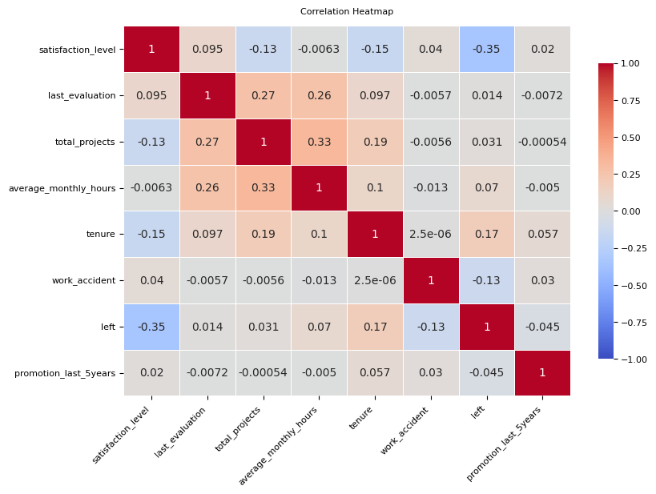
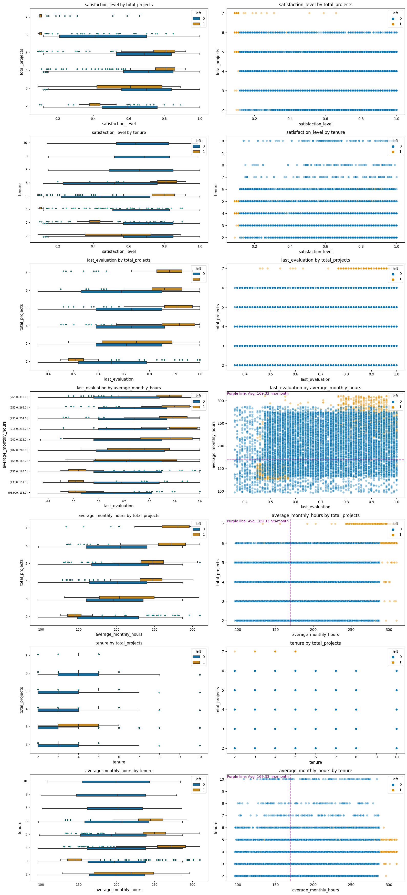

## Google Advanced Data Analytics Capstone
## Table of Contents
- [Introduction](#Salifort-Motors-Employee-Retention-Project)
    - [About the Company](#About-the-Company)
    - [Business Scenario and Problem](#Business-Scenario-and-Problem)
    - [Data Dictionary](#Data-Dictionary)
- [Import and Load Dataset](#Import-and-Load-Dataset)
- [Exploratory Data Analysis (EDA) and Data Cleaning](#Exploratory-Data-Analysis-(EDA)-and-Aata-Cleaning)
    - [Basic information and descriptive statistics](#Basic-information-and-descriptive-statistics)
    - [Rename columns and identify missing and duplicated values](#Rename-columns-and-identify-missing-and-duplicated-values)
    - [Check outliers](#Check-outliers)
    - [Visual data exploration](#Visual-data-exploration)  

#### Salifort Motors Employee Retention Project
##### **About the Company**
Salifort Motors is a fictional French-based alternative energy vehicle manufacturer. Its global workforce of over 100,000 employees research, design, construct, validate, and distribute electric, solar, algae, and hydrogen-based vehicles. Salifort’s end-to-end vertical integration model has made it a global leader at the intersection of alternative energy and automobiles.  

##### **Business Scenario and Problem**  
The HR department at Salifort Motors wants to take some initiatives to improve employee satisfaction levels at the company. They collected data from employees, and now they like to provide data-driven suggestions based on analysis of the data. They have the following question: what’s likely to make the employee leave the company?  
The goals in this project are to analyze the data collected by the HR department and to build a model that predicts whether or not an employee will leave the company.  
If the model can predict employees likely to quit, it might be possible to identify factors that contribute to their leaving. Because it is time-consuming and expensive to find, interview, and hire new employees, increasing employee retention will be beneficial to the company.

##### **Data Dictionary**
The [dataset](https://drive.google.com/drive/folders/1gvylI3XqpDFPW0I4zSJbKZmVhJ-ycHQY?usp=sharing) contain 10 columns and 14,999 rows - each row is a different employee’s self-reported information.

| Column Name | Type| Description |
| :--- | :---| :---|
| satisfaction_level | int64 | The employee’s self-reported satisfaction level [0-1] |
| last_evaluation | int64 | Score of employee's last performance review [0–1] |
| number_project | int64 | Number of projects employee contributes to |
| average_monthly_hours | int64 | Average number of hours employee worked per month |
| time_spend_company | int64 | How long the employee has been with the company (years) |
| work_accident | int64 | Whether or not the employee experienced an accident while at work |
| left| int64 | Whether or not the employee left the company |
| promotion_last_5years | int64 | Whether or not the employee was promoted in the last 5 years |
| department | str | The employee's department |
| salary | str | The employee's salary (low, medium, or high) |

##### **Import and Load Dataset**


```python
# Data manipulation
import numpy as np
import pandas as pd

# Data visualization
import matplotlib.pyplot as plt
import seaborn as sns

# Data modeling
from xgboost import XGBClassifier
from xgboost import XGBRegressor
from xgboost import plot_importance
from sklearn.linear_model import LogisticRegression
from sklearn.tree import DecisionTreeClassifier
from sklearn.ensemble import RandomForestClassifier

# Model evaluation and decision tree visualization
from sklearn.model_selection import GridSearchCV, train_test_split
from sklearn.metrics import accuracy_score, precision_score, recall_score,\
f1_score, confusion_matrix, ConfusionMatrixDisplay, classification_report
from sklearn.metrics import roc_auc_score, roc_curve
from sklearn.tree import plot_tree

# Save models
import pickle

# Handle HTTP requests and input/output operations
import requests
from io import StringIO

# Display all of the columns in dataframes
pd.set_option('display.max_columns', None)

raw_url = 'https://raw.githubusercontent.com/pouriaetab/pouriaetab.github.io/main/data/HR_comma_sep.csv'
# Download the content
response = requests.get(raw_url)
data = StringIO(response.text)
# Read the CSV into a DataFrame
df0 = pd.read_csv(data)
df0.head()
```


<div>
<style scoped>
    .dataframe tbody tr th:only-of-type {
        vertical-align: middle;
    }

    .dataframe tbody tr th {
        vertical-align: top;
    }

    .dataframe thead th {
        text-align: right;
    }
</style>
<table border="1" class="dataframe">
  <thead>
    <tr style="text-align: right;">
      <th></th>
      <th>satisfaction_level</th>
      <th>last_evaluation</th>
      <th>number_project</th>
      <th>average_montly_hours</th>
      <th>time_spend_company</th>
      <th>Work_accident</th>
      <th>left</th>
      <th>promotion_last_5years</th>
      <th>Department</th>
      <th>salary</th>
    </tr>
  </thead>
  <tbody>
    <tr>
      <th>0</th>
      <td>0.38</td>
      <td>0.53</td>
      <td>2</td>
      <td>157</td>
      <td>3</td>
      <td>0</td>
      <td>1</td>
      <td>0</td>
      <td>sales</td>
      <td>low</td>
    </tr>
    <tr>
      <th>1</th>
      <td>0.80</td>
      <td>0.86</td>
      <td>5</td>
      <td>262</td>
      <td>6</td>
      <td>0</td>
      <td>1</td>
      <td>0</td>
      <td>sales</td>
      <td>medium</td>
    </tr>
    <tr>
      <th>2</th>
      <td>0.11</td>
      <td>0.88</td>
      <td>7</td>
      <td>272</td>
      <td>4</td>
      <td>0</td>
      <td>1</td>
      <td>0</td>
      <td>sales</td>
      <td>medium</td>
    </tr>
    <tr>
      <th>3</th>
      <td>0.72</td>
      <td>0.87</td>
      <td>5</td>
      <td>223</td>
      <td>5</td>
      <td>0</td>
      <td>1</td>
      <td>0</td>
      <td>sales</td>
      <td>low</td>
    </tr>
    <tr>
      <th>4</th>
      <td>0.37</td>
      <td>0.52</td>
      <td>2</td>
      <td>159</td>
      <td>3</td>
      <td>0</td>
      <td>1</td>
      <td>0</td>
      <td>sales</td>
      <td>low</td>
    </tr>
  </tbody>
</table>
</div>


##### **Exploratory Data Analysis (EDA) and Data Cleaning**

###### **Basic information and descriptive statistics**


```python
# Basic information about the data 
df0.info()
# Descriptive statistics about the data
df0.describe()
```

    <class 'pandas.core.frame.DataFrame'>
    RangeIndex: 14999 entries, 0 to 14998
    Data columns (total 10 columns):
     #   Column                 Non-Null Count  Dtype  
    ---  ------                 --------------  -----  
     0   satisfaction_level     14999 non-null  float64
     1   last_evaluation        14999 non-null  float64
     2   number_project         14999 non-null  int64  
     3   average_montly_hours   14999 non-null  int64  
     4   time_spend_company     14999 non-null  int64  
     5   Work_accident          14999 non-null  int64  
     6   left                   14999 non-null  int64  
     7   promotion_last_5years  14999 non-null  int64  
     8   Department             14999 non-null  object 
     9   salary                 14999 non-null  object 
    dtypes: float64(2), int64(6), object(2)
    memory usage: 1.1+ MB


<div>
<style scoped>
    .dataframe tbody tr th:only-of-type {
        vertical-align: middle;
    }

    .dataframe tbody tr th {
        vertical-align: top;
    }

    .dataframe thead th {
        text-align: right;
    }
</style>
<table border="1" class="dataframe">
  <thead>
    <tr style="text-align: right;">
      <th></th>
      <th>satisfaction_level</th>
      <th>last_evaluation</th>
      <th>number_project</th>
      <th>average_montly_hours</th>
      <th>time_spend_company</th>
      <th>Work_accident</th>
      <th>left</th>
      <th>promotion_last_5years</th>
    </tr>
  </thead>
  <tbody>
    <tr>
      <th>count</th>
      <td>14999.000000</td>
      <td>14999.000000</td>
      <td>14999.000000</td>
      <td>14999.000000</td>
      <td>14999.000000</td>
      <td>14999.000000</td>
      <td>14999.000000</td>
      <td>14999.000000</td>
    </tr>
    <tr>
      <th>mean</th>
      <td>0.612834</td>
      <td>0.716102</td>
      <td>3.803054</td>
      <td>201.050337</td>
      <td>3.498233</td>
      <td>0.144610</td>
      <td>0.238083</td>
      <td>0.021268</td>
    </tr>
    <tr>
      <th>std</th>
      <td>0.248631</td>
      <td>0.171169</td>
      <td>1.232592</td>
      <td>49.943099</td>
      <td>1.460136</td>
      <td>0.351719</td>
      <td>0.425924</td>
      <td>0.144281</td>
    </tr>
    <tr>
      <th>min</th>
      <td>0.090000</td>
      <td>0.360000</td>
      <td>2.000000</td>
      <td>96.000000</td>
      <td>2.000000</td>
      <td>0.000000</td>
      <td>0.000000</td>
      <td>0.000000</td>
    </tr>
    <tr>
      <th>25%</th>
      <td>0.440000</td>
      <td>0.560000</td>
      <td>3.000000</td>
      <td>156.000000</td>
      <td>3.000000</td>
      <td>0.000000</td>
      <td>0.000000</td>
      <td>0.000000</td>
    </tr>
    <tr>
      <th>50%</th>
      <td>0.640000</td>
      <td>0.720000</td>
      <td>4.000000</td>
      <td>200.000000</td>
      <td>3.000000</td>
      <td>0.000000</td>
      <td>0.000000</td>
      <td>0.000000</td>
    </tr>
    <tr>
      <th>75%</th>
      <td>0.820000</td>
      <td>0.870000</td>
      <td>5.000000</td>
      <td>245.000000</td>
      <td>4.000000</td>
      <td>0.000000</td>
      <td>0.000000</td>
      <td>0.000000</td>
    </tr>
    <tr>
      <th>max</th>
      <td>1.000000</td>
      <td>1.000000</td>
      <td>7.000000</td>
      <td>310.000000</td>
      <td>10.000000</td>
      <td>1.000000</td>
      <td>1.000000</td>
      <td>1.000000</td>
    </tr>
  </tbody>
</table>
</div>


###### **Rename columns and identify missing and duplicated values**


```python
# Rename columns as needed
df0 = df0.rename(columns={'Work_accident': 'work_accident',
                          'average_montly_hours': 'average_monthly_hours',
                          'time_spend_company': 'tenure',
                          'Department': 'department',
                          'number_project' : 'total_projects'})
# Check for missing values helper function
def null_columns(df):
    """
    Display columns with missing values in a user-friendly format.

    Parameters:
    - df: pandas DataFrame

    Returns:
    None
    """
    # Columns with missing values
    null_cols = df.columns[df.isna().sum() > 0]

    # Display user-friendly message
    if len(null_cols) > 0:
        print("Columns with missing values:")
        for col in null_cols:
            print(f"- {col}")
    else:
        print("No columns with missing values.")
null_columns(df0)
```

    No columns with missing values.


```python
def duplicate_percentage(df):
    """
    Print the percentage of duplicated rows in a DataFrame.

    Parameters:
    - df: pandas DataFrame

    Returns:
    None
    """
    dup_sum = df.duplicated().sum()
    dup_pct = (dup_sum / len(df)) * 100
    print(f"Total duplicated rows: {dup_sum: .2f}. \nPercentage of duplicated rows: {dup_pct: .2f}%")
duplicate_percentage(df0)
```

    Total duplicated rows:  3008.00. 
    Percentage of duplicated rows:  20.05%


Performing a likelihood analysis using Bayes' Theorem to calculate the conditional probabilities for each value in each column before dropping the duplicated rows.


```python
def likelihood_analysis(df, target_col):
    """
    Perform likelihood analysis using Bayes' theorem.

    Parameters:
    - df: pandas DataFrame
    - target_col: str, the column for which likelihood analysis is performed

    Returns:
    - likelihood_df: pandas DataFrame, showing the conditional probabilities
    """
    # Create an empty DataFrame to store conditional probabilities
    likelihood_df = pd.DataFrame(index=df.columns, columns=df[target_col].unique())

    for col in df.columns:
        col_values = []
        for value in df[target_col].unique():
            # Calculate the conditional probability of observing 'value' given target_col, P(value | target_col)
            subset = df[df[target_col] == value][col]
            if not subset.empty:
                likelihood = subset.value_counts() / len(subset)
                col_values.append(likelihood.get(1, 0))  # Binary classification (1 is when employee has left)
            else:
                col_values.append(0)  # Handle division by zero

        likelihood_df.loc[col, :] = col_values

    likelihood_df = likelihood_df.fillna(0)  # Handle NaN values

    return likelihood_df

# Target colum is 'left'
result = likelihood_analysis(df0, 'left')
result
```


<div>
<style scoped>
    .dataframe tbody tr th:only-of-type {
        vertical-align: middle;
    }

    .dataframe tbody tr th {
        vertical-align: top;
    }

    .dataframe thead th {
        text-align: right;
    }
</style>
<table border="1" class="dataframe">
  <thead>
    <tr style="text-align: right;">
      <th></th>
      <th>1</th>
      <th>0</th>
    </tr>
  </thead>
  <tbody>
    <tr>
      <th>satisfaction_level</th>
      <td>0.000000</td>
      <td>0.009713</td>
    </tr>
    <tr>
      <th>last_evaluation</th>
      <td>0.046766</td>
      <td>0.010151</td>
    </tr>
    <tr>
      <th>total_projects</th>
      <td>0.000000</td>
      <td>0.000000</td>
    </tr>
    <tr>
      <th>average_monthly_hours</th>
      <td>0.000000</td>
      <td>0.000000</td>
    </tr>
    <tr>
      <th>tenure</th>
      <td>0.000000</td>
      <td>0.000000</td>
    </tr>
    <tr>
      <th>work_accident</th>
      <td>0.047326</td>
      <td>0.175009</td>
    </tr>
    <tr>
      <th>left</th>
      <td>1.000000</td>
      <td>0.000000</td>
    </tr>
    <tr>
      <th>promotion_last_5years</th>
      <td>0.005321</td>
      <td>0.026251</td>
    </tr>
    <tr>
      <th>department</th>
      <td>0.195183</td>
      <td>0.177021</td>
    </tr>
    <tr>
      <th>salary</th>
      <td>0.368804</td>
      <td>0.448810</td>
    </tr>
  </tbody>
</table>
</div>


In the context of this problem, the presence of duplicated rows for some employees is considered an error. The likelihood analysis indicates no high conditional probabilities that significantly differ for the 'left' feature being 1 and 0. Therefore, dropping duplicated rows is unlikely to result in the loss of meaningful information. While the likelihood analysis may not have been strictly necessary due to the presence of several continuous variables across columns, it serves as an additional indicator that these duplicated observations are very unlikely to be legitimate. The likelihood analysis function, however, remains a valuable tool for potential use in future projects.


```python
# Drop duplicates and save resulting dataframe in a new variable
df1 = df0.drop_duplicates(keep='first')
duplicate_percentage(df1)
```

    Total duplicated rows:  0.00. 
    Percentage of duplicated rows:  0.00%


###### **Check outliers**


```python
def create_static_boxplots(df):
    """
    Create static boxplots for non-binary and non-object features.

    Parameters:
    - df: pandas DataFrame

    Returns:
    - None (displays the plots)
    """
    # Get non-object columns
    numeric_columns = df.select_dtypes(['float64', 'int64']).columns

    # Count the number of binary features
    num_binary_features = sum(df[col].nunique() <= 2 for col in numeric_columns)

    # Count the number of object/str features
    num_object_features = sum(df[col].dtype == 'object' for col in df.columns)

    # Define an accessible color palette
    colors = sns.color_palette("colorblind")

    # Filter out binary features
    non_binary_columns = [col for col in numeric_columns if df[col].nunique() > 2]

    # Print information about the features
    print(f"Binary Features: {num_binary_features}")
    print(f"Object/Str Features: {num_object_features}")
    print(f"Total Generated Boxplots: {len(non_binary_columns)}")
    
    # Create subplots with two boxplots per row (handle odd number of boxplots)
    num_plots = len(non_binary_columns)
    num_rows = num_plots // 2 + num_plots % 2
    fig, axes = plt.subplots(num_rows, 2, figsize=(12, 4 * num_rows))
    fig.suptitle("Boxplots for Numeric Features", y=1.02)

    # Remove unnecessary empty subplot if the number of boxplots is odd
    if num_plots % 2 != 0:
        fig.delaxes(axes[-1, -1])

    row, col = 0, 0

    for col_name, color in zip(non_binary_columns, colors):
        sns.boxplot(x=df[col_name], ax=axes[row, col], color=color)
        axes[row, col].set_title(col_name)
        col += 1
        if col > 1:
            col = 0
            row += 1

    plt.tight_layout()
    plt.show()
create_static_boxplots(df1)

```

    Binary Features: 3
    Object/Str Features: 2
    Total Generated Boxplots: 5


    

    


It is evident that the 'tenure' column contains outliers. Subsequently, an investigation will be conducted to determine the number of rows that include outliers in the 'tenure' column.


```python
import pandas as pd

def find_and_display_outliers(df):
    """
    Find and display outliers in non-binary and non-object columns of a DataFrame.

    Parameters:
    - data: pandas DataFrame

    Returns:
    - None (displays information)
    """
    # Select non-binary and non-object columns
    numeric_columns = df.select_dtypes(['float64', 'int64']).columns

    # Filter out binary features
    non_binary_columns = [col for col in numeric_columns if df[col].nunique() > 2]

    for column_name in non_binary_columns:
        # Calculate 25th and 75th percentiles
        q25 = df[column_name].quantile(0.25)
        q75 = df[column_name].quantile(0.75)

        # Calculate interquartile range (IQR)
        iqr = q75 - q25

        # Define lower and upper limits for outliers
        lower_limit = q25 - 1.5 * iqr
        upper_limit = q75 + 1.5 * iqr

        # Identify rows containing outliers
        outliers = df[(df[column_name] < lower_limit) | (df[column_name] > upper_limit)]
        total_outliers = len(outliers)

        # Display information only if outliers are found
        if total_outliers > 0:
            print(f"\nColumn: '{column_name}'")
            print(f"25th Percentile: {q25}")
            print(f"75th Percentile: {q75}")
            print(f"IQR: {iqr}")
            print(f"Lower Limit for Outliers: {lower_limit}")
            print(f"Upper Limit for Outliers: {upper_limit}")
            print(f"Total Rows with Outliers: {total_outliers}")

find_and_display_outliers(df1)

```

    
    Column: 'tenure'
    25th Percentile: 3.0
    75th Percentile: 4.0
    IQR: 1.0
    Lower Limit for Outliers: 1.5
    Upper Limit for Outliers: 5.5
    Total Rows with Outliers: 824


The function provided complements the visual approach for outlier identification through boxplots. It systematically evaluated all non-binary and non-object columns, indicating that 'tenure' is the sole column with outliers, affecting a total of 824 rows in the dataset. This outlier information will play a pivotal role in the decision-making process regarding the choice of a model, as certain models exhibit varying sensitivity to outliers.

###### **Visual data exploration**


```python
plt.figure(figsize=(12, 6))
heatmap = sns.heatmap(df1.corr(numeric_only=True), vmin=-1, vmax=1, annot=True, cmap=sns.color_palette("coolwarm", as_cmap=True), 
                      linewidths=0.5, cbar_kws={"shrink": 0.8},)
plt.xticks(rotation=45, ha='right')
heatmap.set_title('Correlation Heatmap', fontdict={'fontsize':14}, pad=12);
```


    

    


The correlation heatmap above illustrates positive relationships among the number of projects, monthly hours, and evaluation scores. Additionally, it indicates a negative correlation between employee turnover and satisfaction levels.


```python
def create_correlation_plots(data, threshold, target_col):
    """
    Create correlation plots for variable pairs with correlation above a specified threshold.

    Parameters:
    - data: pandas DataFrame, the input dataset
    - threshold: float, the correlation threshold for selecting variable pairs
    - target_col: str, the name of the target column (categorical, binary)

    Returns:
    - None (displays plots)
    """
    # Create a correlation matrix
    correlation_matrix = data.corr(numeric_only=True)

    # Find variable pairs above the threshold (excluding diagonal)
    variable_pairs = [(i, j) for i in range(correlation_matrix.shape[0])
                      for j in range(i + 1, correlation_matrix.shape[1])
                      if abs(correlation_matrix.iloc[i, j]) >= threshold]
    print(variable_pairs)
    # Create subplots with 3 plots per row
    num_rows = (len(variable_pairs) + 2) // 3  # Add 2 for potential extra rows
    fig, axes = plt.subplots(num_rows, 3, figsize=(15, 5 * num_rows))

    # Flatten the axes array for easier indexing
    axes = axes.flatten()

    # Loop through variable pairs and create plots
    for idx, (var1, var2) in enumerate(variable_pairs):
        # Extract variable names
        variable1 = data.columns[var1]
        variable2 = data.columns[var2]

        # Create boxplot
        sns.boxplot(x=variable1, y=variable2, hue=target_col, orient="h", data=data, ax=axes[idx])
        axes[idx].invert_yaxis()
        axes[idx].set_title(f'Boxplot: {variable1} vs {variable2}')
        axes[idx].set_xlabel(variable1)
        axes[idx].set_ylabel(variable2)

        # Create histograms
        sns.histplot(data, x=variable1, hue=target_col, ax=axes[idx + 1], kde=False, bins=20)
        axes[idx + 1].set_title(f'Histogram: {variable1}')
        axes[idx + 1].set_xlabel(variable1)
        axes[idx + 1].set_ylabel('Count')

        sns.histplot(data, x=variable2, hue=target_col, ax=axes[idx + 2], kde=False, bins=20)
        axes[idx + 2].set_title(f'Histogram: {variable2}')
        axes[idx + 2].set_xlabel(variable2)
        axes[idx + 2].set_ylabel('Count')

    # Adjust layout
    plt.tight_layout()

# Example usage:
# Assuming 'df1' is your DataFrame and 'left' is the target variable
create_correlation_plots(df1, threshold=0.1, target_col='left')
plt.show()

```

    [(0, 2), (0, 4), (0, 6), (1, 2), (1, 3), (2, 3), (2, 4), (3, 4), (4, 6), (5, 6)]


    

    


```python
df1.head(1)
```


<div>
<style scoped>
    .dataframe tbody tr th:only-of-type {
        vertical-align: middle;
    }

    .dataframe tbody tr th {
        vertical-align: top;
    }

    .dataframe thead th {
        text-align: right;
    }
</style>
<table border="1" class="dataframe">
  <thead>
    <tr style="text-align: right;">
      <th></th>
      <th>satisfaction_level</th>
      <th>last_evaluation</th>
      <th>total_projects</th>
      <th>average_monthly_hours</th>
      <th>tenure</th>
      <th>work_accident</th>
      <th>left</th>
      <th>promotion_last_5years</th>
      <th>department</th>
      <th>salary</th>
    </tr>
  </thead>
  <tbody>
    <tr>
      <th>0</th>
      <td>0.38</td>
      <td>0.53</td>
      <td>2</td>
      <td>157</td>
      <td>3</td>
      <td>0</td>
      <td>1</td>
      <td>0</td>
      <td>sales</td>
      <td>low</td>
    </tr>
  </tbody>
</table>
</div>


```python
def plot_data(df, threshold, target_col):
    # Set the color palette to be visually accessible
    sns.set_palette("colorblind")

    # Define the variable ranges for each row of plots
    # variable_ranges = [(0, 1), (1, 3), (0, 2)]
    
    # Create a correlation matrix
    correlation_matrix = df.corr()

    # Find variable pairs above the threshold (excluding diagonal)
    variable_ranges = [(i, j) for i in range(correlation_matrix.shape[0])
                      for j in range(i + 1, correlation_matrix.shape[1])
                      if abs(correlation_matrix.iloc[i, j]) >= threshold]
    
    # Create the plots using a loop
    num_rows = len(variable_ranges)

    fig, axes = plt.subplots(num_rows, 3, figsize=(15, 5 * num_rows))

    for i, row_range in enumerate(variable_ranges):
        sns.boxplot(x=df.columns[row_range[0]], y=df.columns[row_range[1]], hue=target_col, data=df, ax=axes[i, 0], orient="h")
        axes[i, 0].invert_yaxis()

        sns.histplot(df, x=df.columns[row_range[0]], hue=target_col, multiple="dodge", shrink=6, ax=axes[i, 1])

        sns.histplot(df, x=df.columns[row_range[1]], hue=target_col, multiple="dodge", shrink=6, ax=axes[i, 2])

    # Show the plots
    plt.tight_layout()
    plt.show()

# # Example usage:
# # Assuming you have a DataFrame 'dataa' with columns 'var1', 'var2', 'var3', 'var4', 'var5', 'var6'
# # Call the function as follows:
# np.random.seed(42)
# dataa = pd.DataFrame({
#     'var1': np.random.normal(0, 1, 100),
#     'var2': np.random.normal(1, 1, 100),
#     'var3': np.random.choice([0,1], 100),
#     'var4': np.random.normal(1, 1, 100),
#     'var5': np.random.normal(0, 1, 100),
#     'var6': np.random.normal(1, 1, 100),
# })
# plot_data(dataa, 'var3')
# plot_data(df1, threshold=0.1, target_col='left')

```


```python
def plot_data(df, threshold, target_col, rows_to_display=None):
    """
    Create a set of plots for variable pairs based on correlation and visualize the distribution of data.

    Parameters:
        df (pd.DataFrame): The input DataFrame containing the variables.
        threshold (float): The correlation threshold for selecting variable pairs.
        target_col (str): The target column for hue in boxplots.
        rows_to_display (Optional[Tuple[int, int]]): A tuple specifying the range of rows to display.
            If None, all rows will be displayed. The tuple should be in the format (start_row, end_row),
            where start_row is the index of the first row to display, and end_row is the index of the last row to display.

    Returns:
        None: Displays a set of plots based on the specified parameters.

    Examples:
        # Display all rows
        plot_data(df1, threshold=0.1, target_col='left', rows_to_display=None)

        # Display only the first three rows
        plot_data(df1, threshold=0.1, target_col='left', rows_to_display=(0, 2))

    Note:
        The variable pairs are selected based on the correlation threshold.
        When choosing specific rows to display, ensure that the specified range is valid and within the available rows.
        If rows_to_display is None, all available rows will be displayed.
    """
    
    # Set the color palette to be visually accessible
    sns.set_palette("colorblind")

    # Create a correlation matrix
    correlation_matrix = df.corr(numeric_only=True)

    # Find the index of the target column
    target_col_index = df.columns.get_loc(target_col)

    # Find variable pairs above the threshold (excluding diagonal and target_col)
    variable_ranges = [(i, j) for i in range(correlation_matrix.shape[0])
                       for j in range(i + 1, correlation_matrix.shape[1])
                       if abs(correlation_matrix.iloc[i, j]) >= threshold
                       and target_col_index not in (i, j)]

    # Filter variable ranges based on rows_to_display
    if rows_to_display:
        variable_ranges = variable_ranges[rows_to_display[0]:rows_to_display[1]]

    # Create the plots using a loop
    num_rows = len(variable_ranges)

    fig, axes = plt.subplots(num_rows, 3, figsize=(18, 5 * num_rows))

    for i, row_range in enumerate(variable_ranges):
        var1, var2 = df.columns[row_range[0]], df.columns[row_range[1]]

        # Determine x-axis and y-axis variables based on nunique()
        if df[var1].nunique() > 50:
            x_axis_var, y_axis_var = var1, var2
        else:
            x_axis_var, y_axis_var = var2, var1

        sns.boxplot(x=x_axis_var, y=y_axis_var, hue=target_col, data=df, ax=axes[i, 0], orient="h", 
                    width=0.3, flierprops=dict(markerfacecolor='r', markersize=6, marker='o'))
        axes[i, 0].invert_yaxis()
        sns.histplot(df, x=x_axis_var, hue=target_col, multiple="dodge", ax=axes[i, 1])
        sns.histplot(df, x=y_axis_var, hue=target_col, multiple="dodge", ax=axes[i, 2])

    # Show the plots
    plt.tight_layout()
    plt.show()

# rows_to
plot_data(df1, threshold=0.1, target_col='left', rows_to_display=(1,1))

```


    ---------------------------------------------------------------------------

    ValueError                                Traceback (most recent call last)

    Cell In[68], line 73
         70     plt.show()
         72 # rows_to
    ---> 73 plot_data(df1, threshold=0.1, target_col='left', rows_to_display=(1,1))


    Cell In[68], line 51, in plot_data(df, threshold, target_col, rows_to_display)
         48 # Create the plots using a loop
         49 num_rows = len(variable_ranges)
    ---> 51 fig, axes = plt.subplots(num_rows, 3, figsize=(18, 5 * num_rows))
         53 for i, row_range in enumerate(variable_ranges):
         54     var1, var2 = df.columns[row_range[0]], df.columns[row_range[1]]


    File /Library/Frameworks/Python.framework/Versions/3.11/lib/python3.11/site-packages/matplotlib/pyplot.py:1502, in subplots(nrows, ncols, sharex, sharey, squeeze, width_ratios, height_ratios, subplot_kw, gridspec_kw, **fig_kw)
       1358 """
       1359 Create a figure and a set of subplots.
       1360 
       (...)
       1499 
       1500 """
       1501 fig = figure(**fig_kw)
    -> 1502 axs = fig.subplots(nrows=nrows, ncols=ncols, sharex=sharex, sharey=sharey,
       1503                    squeeze=squeeze, subplot_kw=subplot_kw,
       1504                    gridspec_kw=gridspec_kw, height_ratios=height_ratios,
       1505                    width_ratios=width_ratios)
       1506 return fig, axs


    File /Library/Frameworks/Python.framework/Versions/3.11/lib/python3.11/site-packages/matplotlib/figure.py:916, in FigureBase.subplots(self, nrows, ncols, sharex, sharey, squeeze, width_ratios, height_ratios, subplot_kw, gridspec_kw)
        912         raise ValueError("'width_ratios' must not be defined both as "
        913                          "parameter and as key in 'gridspec_kw'")
        914     gridspec_kw['width_ratios'] = width_ratios
    --> 916 gs = self.add_gridspec(nrows, ncols, figure=self, **gridspec_kw)
        917 axs = gs.subplots(sharex=sharex, sharey=sharey, squeeze=squeeze,
        918                   subplot_kw=subplot_kw)
        919 return axs


    File /Library/Frameworks/Python.framework/Versions/3.11/lib/python3.11/site-packages/matplotlib/figure.py:1544, in FigureBase.add_gridspec(self, nrows, ncols, **kwargs)
       1505 """
       1506 Return a `.GridSpec` that has this figure as a parent.  This allows
       1507 complex layout of Axes in the figure.
       (...)
       1540 
       1541 """
       1543 _ = kwargs.pop('figure', None)  # pop in case user has added this...
    -> 1544 gs = GridSpec(nrows=nrows, ncols=ncols, figure=self, **kwargs)
       1545 return gs


    File /Library/Frameworks/Python.framework/Versions/3.11/lib/python3.11/site-packages/matplotlib/gridspec.py:379, in GridSpec.__init__(self, nrows, ncols, figure, left, bottom, right, top, wspace, hspace, width_ratios, height_ratios)
        376 self.hspace = hspace
        377 self.figure = figure
    --> 379 super().__init__(nrows, ncols,
        380                  width_ratios=width_ratios,
        381                  height_ratios=height_ratios)


    File /Library/Frameworks/Python.framework/Versions/3.11/lib/python3.11/site-packages/matplotlib/gridspec.py:49, in GridSpecBase.__init__(self, nrows, ncols, height_ratios, width_ratios)
         34 """
         35 Parameters
         36 ----------
       (...)
         46     If not given, all rows will have the same height.
         47 """
         48 if not isinstance(nrows, Integral) or nrows <= 0:
    ---> 49     raise ValueError(
         50         f"Number of rows must be a positive integer, not {nrows!r}")
         51 if not isinstance(ncols, Integral) or ncols <= 0:
         52     raise ValueError(
         53         f"Number of columns must be a positive integer, not {ncols!r}")


    ValueError: Number of rows must be a positive integer, not 0


    <Figure size 1800x0 with 0 Axes>


```python
df1.head(1)
```


<div>
<style scoped>
    .dataframe tbody tr th:only-of-type {
        vertical-align: middle;
    }

    .dataframe tbody tr th {
        vertical-align: top;
    }

    .dataframe thead th {
        text-align: right;
    }
</style>
<table border="1" class="dataframe">
  <thead>
    <tr style="text-align: right;">
      <th></th>
      <th>satisfaction_level</th>
      <th>last_evaluation</th>
      <th>total_projects</th>
      <th>average_monthly_hours</th>
      <th>tenure</th>
      <th>work_accident</th>
      <th>left</th>
      <th>promotion_last_5years</th>
      <th>department</th>
      <th>salary</th>
    </tr>
  </thead>
  <tbody>
    <tr>
      <th>0</th>
      <td>0.38</td>
      <td>0.53</td>
      <td>2</td>
      <td>157</td>
      <td>3</td>
      <td>0</td>
      <td>1</td>
      <td>0</td>
      <td>sales</td>
      <td>low</td>
    </tr>
  </tbody>
</table>
</div>


```python
fig, ax = plt.subplots(1, 2, figsize = (22,8))
df1['average_monthly_hours'].nunique()
sns.boxplot(data=df1, x='average_monthly_hours', y='total_projects', hue='left', orient="h", ax=ax[0])
ax[0].invert_yaxis()
ax[0].set_title('Monthly hours by number of projects', fontsize='14')

df1['average_monthly_hours'].nunique()
sns.boxplot(data=df1, x='average_monthly_hours', y='last_evaluation', hue='left', orient="h", ax=ax[1])
ax[1].invert_yaxis()
ax[1].set_title('Monthly hours by number of projects', fontsize='14')
plt.show()
```


    

    


```python

```


    215


```python
def plot_data(df, threshold, target_col, rows_to_display=None):
    """
    Create a set of plots for variable pairs based on correlation and visualize the distribution of data.

    Parameters:
        df (pd.DataFrame): The input DataFrame containing the variables.
        threshold (float): The correlation threshold for selecting variable pairs.
        target_col (str): The target column for hue in boxplots.
        rows_to_display (Optional[Tuple[int, int]]): A tuple specifying the range of rows to display.
            If None, all rows will be displayed. The tuple should be in the format (start_row, end_row),
            where start_row is the index of the first row to display, and end_row is the index of the last row to display.

    Returns:
        None: Displays a set of plots based on the specified parameters.

    Examples:
        # Display all rows
        plot_data(df1, threshold=0.1, target_col='left', rows_to_display=None)

        # Display only the first three rows
        plot_data(df1, threshold=0.1, target_col='left', rows_to_display=(0, 2))

        # Display only the second row
        plot_data(df1, threshold=0.1, target_col='left', rows_to_display=(1, 1))
    """
    # Set the color palette to be visually accessible
    sns.set_palette("colorblind")

    # Create a correlation matrix
    correlation_matrix = df.corr(numeric_only=True)

    # Find the index of the target column
    target_col_index = df.columns.get_loc(target_col)

    # Find variable pairs above the threshold (excluding diagonal and target_col)
    variable_ranges = [(i, j) for i in range(correlation_matrix.shape[0])
                       for j in range(i + 1, correlation_matrix.shape[1])
                       if abs(correlation_matrix.iloc[i, j]) >= threshold
                       and target_col_index not in (i, j)]

    # Filter variable ranges based on rows_to_display
    if rows_to_display is not None:
        variable_ranges = variable_ranges[rows_to_display[0]: rows_to_display[1] + 1]

    # Check if variable_ranges is empty
    if not variable_ranges:
        print("No rows to display.")
        return

    # Create the plots using a loop
    num_rows = len(variable_ranges)

    fig, axes = plt.subplots(num_rows, 3, figsize=(25, 5 * num_rows))

    for i, row_range in enumerate(variable_ranges):
        var1, var2 = df.columns[row_range[0]], df.columns[row_range[1]]

        # Determine x-axis and y-axis variables based on nunique()
        if df[var1].nunique() > 50:
            x_axis_var, y_axis_var = var1, var2
        else:
            x_axis_var, y_axis_var = var2, var1

        # Handle the case when only one row is being displayed
        if num_rows == 1:
            # For a single row, axes[i] becomes a 1D array
            sns.boxplot(x=x_axis_var, y=y_axis_var, hue=target_col, data=df, ax=axes[0], orient="h", width=0.3, flierprops=dict(markerfacecolor='cyan', markersize=3, marker='o'))
            axes[0].invert_yaxis()
            axes[0].set_title(f'{x_axis_var} by {y_axis_var}', fontsize='11')
            axes[0].tick_params(axis='both', labelsize=9)
            axes[0].set_xlabel(x_axis_var, fontsize=9)
            axes[0].set_ylabel(y_axis_var, fontsize=9)
            axes[0].legend(title=target_col, title_fontsize=9)
            sns.histplot(df, x=x_axis_var, hue=target_col, multiple="dodge", ax=axes[1])
            sns.histplot(df, x=y_axis_var, hue=target_col, multiple="dodge", ax=axes[2])
        else:
            # For multiple rows, continue with the original approach
            sns.boxplot(x=x_axis_var, y=y_axis_var, hue=target_col, data=df, ax=axes[i, 0], orient="h", width=0.3, flierprops=dict(markerfacecolor='cyan', markersize=3, marker='o'))
            axes[i, 0].invert_yaxis()
            axes[i, 0].set_title(f'{x_axis_var} by {y_axis_var}', fontsize='11')
            axes[i, 0].tick_params(axis='both', labelsize=9)
            axes[i, 0].set_xlabel(x_axis_var, fontsize=9)
            axes[i, 0].set_ylabel(y_axis_var, fontsize=9)
            axes[i, 0].legend(title=target_col, title_fontsize=9)
            sns.histplot(df, x=x_axis_var, hue=target_col, multiple="dodge", ax=axes[i, 1])
            sns.histplot(df, x=y_axis_var, hue=target_col, multiple="dodge", ax=axes[i, 2])

    # Show the plots
    plt.tight_layout()
    plt.show()

plot_data(df1, threshold=0.1, target_col='left', rows_to_display=None)

```


    

    


```python
df1.nunique()
```


    satisfaction_level        92
    last_evaluation           65
    total_projects             6
    average_monthly_hours    215
    tenure                     8
    work_accident              2
    left                       2
    promotion_last_5years      2
    department                10
    salary                     3
    dtype: int64


```python

```


```python
# Set figure and axes
fig, ax = plt.subplots(1, 2, figsize = (22,8))

# Create boxplot showing distributions of `satisfaction_level` by tenure, comparing employees who stayed versus those who left
sns.boxplot(data=df1, x='satisfaction_level', y='tenure', hue='left', orient="h", ax=ax[0])
ax[0].invert_yaxis()
ax[0].set_title('Satisfaction by tenure', fontsize='14')

# Create histogram showing distribution of `tenure`, comparing employees who stayed versus those who left
tenure_stay = df1[df1['left']==0]['tenure']
tenure_left = df1[df1['left']==1]['tenure']
sns.histplot(data=df1, x='tenure', hue='left', multiple='dodge', shrink=5, ax=ax[1])
ax[1].set_title('Tenure histogram', fontsize='14')


plt.show();

# Set figure and axes
fig, ax = plt.subplots(1, 2, figsize = (22,8))

# Create boxplot showing `average_monthly_hours` distributions for `number_project`, comparing employees who stayed versus those who left
sns.boxplot(data=df1, x='average_monthly_hours', y='number_project', hue='left', orient="h", ax=ax[0])
ax[0].invert_yaxis()
ax[0].set_title('Monthly hours by number of projects', fontsize='14')

# Create histogram showing distribution of `number_project`, comparing employees who stayed versus those who left
tenure_stay = df1[df1['left']==0]['number_project']
tenure_left = df1[df1['left']==1]['number_project']
sns.histplot(data=df1, x='number_project', hue='left', multiple='dodge', shrink=2, ax=ax[1])
ax[1].set_title('Number of projects histogram', fontsize='14')

# Display the plots
plt.show()

```


```python
df1['work_accident'].unique()
```


    array([0, 1])


```python
df1.dtypes
```


    satisfaction_level       float64
    last_evaluation          float64
    total_projects             int64
    average_monthly_hours      int64
    tenure                     int64
    work_accident              int64
    left                       int64
    promotion_last_5years      int64
    department                object
    salary                    object
    dtype: object


```python
df1.head()
```


<div>
<style scoped>
    .dataframe tbody tr th:only-of-type {
        vertical-align: middle;
    }

    .dataframe tbody tr th {
        vertical-align: top;
    }

    .dataframe thead th {
        text-align: right;
    }
</style>
<table border="1" class="dataframe">
  <thead>
    <tr style="text-align: right;">
      <th></th>
      <th>satisfaction_level</th>
      <th>last_evaluation</th>
      <th>total_projects</th>
      <th>average_monthly_hours</th>
      <th>tenure</th>
      <th>work_accident</th>
      <th>left</th>
      <th>promotion_last_5years</th>
      <th>department</th>
      <th>salary</th>
    </tr>
  </thead>
  <tbody>
    <tr>
      <th>0</th>
      <td>0.38</td>
      <td>0.53</td>
      <td>2</td>
      <td>157</td>
      <td>3</td>
      <td>0</td>
      <td>1</td>
      <td>0</td>
      <td>sales</td>
      <td>low</td>
    </tr>
    <tr>
      <th>1</th>
      <td>0.80</td>
      <td>0.86</td>
      <td>5</td>
      <td>262</td>
      <td>6</td>
      <td>0</td>
      <td>1</td>
      <td>0</td>
      <td>sales</td>
      <td>medium</td>
    </tr>
    <tr>
      <th>2</th>
      <td>0.11</td>
      <td>0.88</td>
      <td>7</td>
      <td>272</td>
      <td>4</td>
      <td>0</td>
      <td>1</td>
      <td>0</td>
      <td>sales</td>
      <td>medium</td>
    </tr>
    <tr>
      <th>3</th>
      <td>0.72</td>
      <td>0.87</td>
      <td>5</td>
      <td>223</td>
      <td>5</td>
      <td>0</td>
      <td>1</td>
      <td>0</td>
      <td>sales</td>
      <td>low</td>
    </tr>
    <tr>
      <th>4</th>
      <td>0.37</td>
      <td>0.52</td>
      <td>2</td>
      <td>159</td>
      <td>3</td>
      <td>0</td>
      <td>1</td>
      <td>0</td>
      <td>sales</td>
      <td>low</td>
    </tr>
  </tbody>
</table>
</div>


```python


# ## Step 2. Data Exploration (Continue EDA)
# # Get numbers of people who left vs. stayed
# print(df1['left'].value_counts())
# print()
# # Get percentages of people who left vs. stayed
# print(df1['left'].value_counts(normalize=True))
# # Data visualizations
# # Create a plot as needed 
# # Set figure and axes
# fig, ax = plt.subplots(1, 2, figsize = (22,8))
# # Create boxplot showing `average_monthly_hours` distributions for `number_project`, comparing employees who stayed versus those who left
# sns.boxplot(data=df1, x='average_monthly_hours', y='number_project', hue='left', orient="h", ax=ax[0])
# ax[0].invert_yaxis()
# ax[0].set_title('Monthly hours by number of projects', fontsize='14')
# # Create histogram showing distribution of `number_project`, comparing employees who stayed versus those who left
# tenure_stay = df1[df1['left']==0]['number_project']
# tenure_left = df1[df1['left']==1]['number_project']
# sns.histplot(data=df1, x='number_project', hue='left', multiple='dodge', shrink=2, ax=ax[1])
# ax[1].set_title('Number of projects histogram', fontsize='14')
# # Display the plots
# plt.show()
# # Get value counts of stayed/left for employees with 7 projects
# df1[df1['number_project']==7]['left'].value_counts()
# # Create a plot as needed 
# # Create scatterplot of `average_monthly_hours` versus `satisfaction_level`, comparing employees who stayed versus those who left
# plt.figure(figsize=(16, 9))
# sns.scatterplot(data=df1, x='average_monthly_hours', y='satisfaction_level', hue='left', alpha=0.4)
# plt.axvline(x=166.67, color='#ff6361', label='166.67 hrs./mo.', ls='--')
# plt.legend(labels=['166.67 hrs./mo.', 'left', 'stayed'])
# plt.title('Monthly hours by last evaluation score', fontsize='14');
# # Create a plot as needed 
# # Set figure and axes
# fig, ax = plt.subplots(1, 2, figsize = (22,8))
# # Create boxplot showing distributions of `satisfaction_level` by tenure, comparing employees who stayed versus those who left
# sns.boxplot(data=df1, x='satisfaction_level', y='tenure', hue='left', orient="h", ax=ax[0])
# ax[0].invert_yaxis()
# ax[0].set_title('Satisfaction by tenure', fontsize='14')
# # Create histogram showing distribution of `tenure`, comparing employees who stayed versus those who left
# tenure_stay = df1[df1['left']==0]['tenure']
# tenure_left = df1[df1['left']==1]['tenure']
# sns.histplot(data=df1, x='tenure', hue='left', multiple='dodge', shrink=5, ax=ax[1])
# ax[1].set_title('Tenure histogram', fontsize='14')
# plt.show();
# # Calculate mean and median satisfaction scores of employees who left and those who stayed
# df1.groupby(['left'])['satisfaction_level'].agg([np.mean,np.median])
# # Create a plot as needed 
# # Set figure and axes
# fig, ax = plt.subplots(1, 2, figsize = (22,8))
# # Define short-tenured employees
# tenure_short = df1[df1['tenure'] < 7]
# # Define long-tenured employees
# tenure_long = df1[df1['tenure'] > 6]
# # Plot short-tenured histogram
# sns.histplot(data=tenure_short, x='tenure', hue='salary', discrete=1, 
#              hue_order=['low', 'medium', 'high'], multiple='dodge', shrink=.5, ax=ax[0])
# ax[0].set_title('Salary histogram by tenure: short-tenured people', fontsize='14')
# # Plot long-tenured histogram
# sns.histplot(data=tenure_long, x='tenure', hue='salary', discrete=1, 
#              hue_order=['low', 'medium', 'high'], multiple='dodge', shrink=.4, ax=ax[1])
# ax[1].set_title('Salary histogram by tenure: long-tenured people', fontsize='14');
# # Create a plot as needed 
# # Create scatterplot of `average_monthly_hours` versus `last_evaluation`
# plt.figure(figsize=(16, 9))
# sns.scatterplot(data=df1, x='average_monthly_hours', y='last_evaluation', hue='left', alpha=0.4)
# plt.axvline(x=166.67, color='#ff6361', label='166.67 hrs./mo.', ls='--')
# plt.legend(labels=['166.67 hrs./mo.', 'left', 'stayed'])
# plt.title('Monthly hours by last evaluation score', fontsize='14');
# # Create a plot as needed 
# # Create plot to examine relationship between `average_monthly_hours` and `promotion_last_5years`
# plt.figure(figsize=(16, 3))
# sns.scatterplot(data=df1, x='average_monthly_hours', y='promotion_last_5years', hue='left', alpha=0.4)
# plt.axvline(x=166.67, color='#ff6361', ls='--')
# plt.legend(labels=['166.67 hrs./mo.', 'left', 'stayed'])
# plt.title('Monthly hours by promotion last 5 years', fontsize='14');
# # Display counts for each department
# df1["department"].value_counts()
# # Create a plot as needed 
# # Create stacked histogram to compare department distribution of employees who left to that of employees who didn't
# plt.figure(figsize=(11,8))
# sns.histplot(data=df1, x='department', hue='left', discrete=1, 
#              hue_order=[0, 1], multiple='dodge', shrink=.5)
# plt.xticks(rotation='45')
# plt.title('Counts of stayed/left by department', fontsize=14);
# # Create a plot as needed 
# # Plot a correlation heatmap
# plt.figure(figsize=(16, 9))
# heatmap = sns.heatmap(df0.corr(), vmin=-1, vmax=1, annot=True, cmap=sns.color_palette("vlag", as_cmap=True))
# heatmap.set_title('Correlation Heatmap', fontdict={'fontsize':14}, pad=12);
# # paCe: Construct Stage
# ## Step 3. Model Building, Step 4. Results and Evaluation

# # Modeling Approach A: Logistic Regression Model
# # Logistic regression
# # Copy the dataframe
# df_enc = df1.copy()
# # Encode the `salary` column as an ordinal numeric category
# df_enc['salary'] = (
#     df_enc['salary'].astype('category')
#     .cat.set_categories(['low', 'medium', 'high'])
#     .cat.codes
# )
# # Dummy encode the `department` column
# df_enc = pd.get_dummies(df_enc, drop_first=False)
# # Display the new dataframe
# df_enc.head()
# # Create a heatmap to visualize how correlated variables are
# plt.figure(figsize=(8, 6))
# sns.heatmap(df_enc[['satisfaction_level', 'last_evaluation', 'number_project', 'average_monthly_hours', 'tenure']]
#             .corr(), annot=True, cmap="crest")
# plt.title('Heatmap of the dataset')
# plt.show()
# # Create a stacked bart plot to visualize number of employees across department, comparing those who left with those who didn't
# # In the legend, 0 (purple color) represents employees who did not leave, 1 (red color) represents employees who left
# pd.crosstab(df1['department'], df1['left']).plot(kind ='bar',color='mr')
# plt.title('Counts of employees who left versus stayed across department')
# plt.ylabel('Employee count')
# plt.xlabel('Department')
# plt.show()
# # Select rows without outliers in `tenure` and save resulting dataframe in a new variable
# df_logreg = df_enc[(df_enc['tenure'] >= lower_limit) & (df_enc['tenure'] <= upper_limit)]
# # Display first few rows of new dataframe
# df_logreg.head()
# # Isolate the outcome variable
# y = df_logreg['left']
# # Display first few rows of the outcome variable
# y.head() 
# # Select the features you want to use in your model
# X = df_logreg.drop('left', axis=1)
# # Display the first few rows of the selected features 
# X.head()
# # Split the data into training set and testing set
# X_train, X_test, y_train, y_test = train_test_split(X, y, test_size=0.25, stratify=y, random_state=42)
# # Construct a logistic regression model and fit it to the training dataset
# log_clf = LogisticRegression(random_state=42, max_iter=500).fit(X_train, y_train)
# # Use the logistic regression model to get predictions on the test set
# y_pred = log_clf.predict(X_test)
# # Compute values for confusion matrix
# log_cm = confusion_matrix(y_test, y_pred, labels=log_clf.classes_)
# # Create display of confusion matrix
# log_disp = ConfusionMatrixDisplay(confusion_matrix=log_cm, 
#                                   display_labels=log_clf.classes_)
# # Plot confusion matrix
# log_disp.plot(values_format='')
# # Display plot
# plt.show()
# df_logreg['left'].value_counts(normalize=True)
# # Create classification report for logistic regression model
# target_names = ['Predicted would not leave', 'Predicted would leave']
# print(classification_report(y_test, y_pred, target_names=target_names))
# # Create classification report for logistic regression model
# target_names = ['Predicted would not leave', 'Predicted would leave']
# print(classification_report(y_test, y_pred, target_names=target_names))

# # Modeling Approach B: Tree-based Model
# # Isolate the outcome variable
# y = df_enc['left']
# # Display the first few rows of `y`
# y.head()
# # Select the features
# X = df_enc.drop('left', axis=1)
# # Display the first few rows of `X`
# X.head()
# # Split the data
# X_train, X_test, y_train, y_test = train_test_split(X, y, test_size=0.25, stratify=y, random_state=0)
# # Decision tree - Round 1
# # Instantiate model
# tree = DecisionTreeClassifier(random_state=0)
# # Assign a dictionary of hyperparameters to search over
# cv_params = {'max_depth':[4, 6, 8, None],
#              'min_samples_leaf': [2, 5, 1],
#              'min_samples_split': [2, 4, 6]
#              }
# # Assign a dictionary of scoring metrics to capture
# scoring = {'accuracy', 'precision', 'recall', 'f1', 'roc_auc'}
# # Instantiate GridSearch
# tree1 = GridSearchCV(tree, cv_params, scoring=scoring, cv=4, refit='roc_auc')
# %%time
# tree1.fit(X_train, y_train)
# # Check best parameters
# tree1.best_params_
# # Check best AUC score on CV
# tree1.best_score_
# def make_results(model_name:str, model_object, metric:str):
#     '''
#     Arguments:
#         model_name (string): what you want the model to be called in the output table
#         model_object: a fit GridSearchCV object
#         metric (string): precision, recall, f1, accuracy, or auc
  
#     Returns a pandas df with the F1, recall, precision, accuracy, and auc scores
#     for the model with the best mean 'metric' score across all validation folds.  
#     '''
#     # Create dictionary that maps input metric to actual metric name in GridSearchCV
#     metric_dict = {'auc': 'mean_test_roc_auc',
#                    'precision': 'mean_test_precision',
#                    'recall': 'mean_test_recall',
#                    'f1': 'mean_test_f1',
#                    'accuracy': 'mean_test_accuracy'
#                   }
#     # Get all the results from the CV and put them in a df
#     cv_results = pd.DataFrame(model_object.cv_results_)
#     # Isolate the row of the df with the max(metric) score
#     best_estimator_results = cv_results.iloc[cv_results[metric_dict[metric]].idxmax(), :]
#     # Extract Accuracy, precision, recall, and f1 score from that row
#     auc = best_estimator_results.mean_test_roc_auc
#     f1 = best_estimator_results.mean_test_f1
#     recall = best_estimator_results.mean_test_recall
#     precision = best_estimator_results.mean_test_precision
#     accuracy = best_estimator_results.mean_test_accuracy
#     # Create table of results
#     table = pd.DataFrame()
#     table = pd.DataFrame({'model': [model_name],
#                           'precision': [precision],
#                           'recall': [recall],
#                           'F1': [f1],
#                           'accuracy': [accuracy],
#                           'auc': [auc]
#                         })
#     return table
# # Random forest - Round 1
# # Get all CV scores
# tree1_cv_results = make_results('decision tree cv', tree1, 'auc')
# tree1_cv_results
# # Instantiate model
# rf = RandomForestClassifier(random_state=0)
# # Assign a dictionary of hyperparameters to search over
# cv_params = {'max_depth': [3,5, None], 
#              'max_features': [1.0],
#              'max_samples': [0.7, 1.0],
#              'min_samples_leaf': [1,2,3],
#              'min_samples_split': [2,3,4],
#              'n_estimators': [300, 500],
#              }  
# # Assign a dictionary of scoring metrics to capture
# scoring = {'accuracy', 'precision', 'recall', 'f1', 'roc_auc'}
# # Instantiate GridSearch
# rf1 = GridSearchCV(rf, cv_params, scoring=scoring, cv=4, refit='roc_auc')
# %%time
# rf1.fit(X_train, y_train) # --> Wall time: ~10min
# # Define a path to the folder where you want to save the model
# path = '/home/jovyan/work/'
# def write_pickle(path, model_object, save_as:str):
#     '''
#     In: 
#         path:         path of folder where you want to save the pickle
#         model_object: a model you want to pickle
#         save_as:      filename for how you want to save the model

#     Out: A call to pickle the model in the folder indicated
#     '''    

#     with open(path + save_as + '.pickle', 'wb') as to_write:
#         pickle.dump(model_object, to_write)
# def read_pickle(path, saved_model_name:str):
#     '''
#     In: 
#         path:             path to folder where you want to read from
#         saved_model_name: filename of pickled model you want to read in

#     Out: 
#         model: the pickled model 
#     '''
#     with open(path + saved_model_name + '.pickle', 'rb') as to_read:
#         model = pickle.load(to_read)

#     return model
# # Write pickle
# write_pickle(path, rf1, 'hr_rf1')
# # Read pickle
# rf1 = read_pickle(path, 'hr_rf1')
# # Check best AUC score on CV
# rf1.best_score_
# # Check best params
# rf1.best_params_
# # Get all CV scores
# rf1_cv_results = make_results('random forest cv', rf1, 'auc')
# print(tree1_cv_results)
# print(rf1_cv_results)
# def get_scores(model_name:str, model, X_test_data, y_test_data):
#     '''
#     Generate a table of test scores.
#     In: 
#         model_name (string):  How you want your model to be named in the output table
#         model:                A fit GridSearchCV object
#         X_test_data:          numpy array of X_test data
#         y_test_data:          numpy array of y_test data
#     Out: pandas df of precision, recall, f1, accuracy, and AUC scores for your model
#     '''
#     preds = model.best_estimator_.predict(X_test_data)
#     auc = roc_auc_score(y_test_data, preds)
#     accuracy = accuracy_score(y_test_data, preds)
#     precision = precision_score(y_test_data, preds)
#     recall = recall_score(y_test_data, preds)
#     f1 = f1_score(y_test_data, preds)
#     table = pd.DataFrame({'model': [model_name],
#                           'precision': [precision], 
#                           'recall': [recall],
#                           'f1': [f1],
#                           'accuracy': [accuracy],
#                           'AUC': [auc]
#                          })
#     return table
# # Get predictions on test data
# rf1_test_scores = get_scores('random forest1 test', rf1, X_test, y_test)
# rf1_test_scores
# # Feature Engineering
# # Drop `satisfaction_level` and save resulting dataframe in new variable
# df2 = df_enc.drop('satisfaction_level', axis=1)
# # Display first few rows of new dataframe
# df2.head()
# # Create `overworked` column. For now, it's identical to average monthly hours.
# df2['overworked'] = df2['average_monthly_hours']
# # Inspect max and min average monthly hours values
# print('Max hours:', df2['overworked'].max())
# print('Min hours:', df2['overworked'].min())
# # Define `overworked` as working > 175 hrs/week
# df2['overworked'] = (df2['overworked'] > 175).astype(int)
# # Display first few rows of new column
# df2['overworked'].head()
# # Drop the `average_monthly_hours` column
# df2 = df2.drop('average_monthly_hours', axis=1)
# # Display first few rows of resulting dataframe
# df2.head()
# # Isolate the outcome variable
# y = df2['left']
# # Select the features
# X = df2.drop('left', axis=1)
# # Create test data
# X_train, X_test, y_train, y_test = train_test_split(X, y, test_size=0.25, stratify=y, random_state=0)
# # Decision tree - Round 2
# # Instantiate model
# tree = DecisionTreeClassifier(random_state=0)
# # Assign a dictionary of hyperparameters to search over
# cv_params = {'max_depth':[4, 6, 8, None],
#              'min_samples_leaf': [2, 5, 1],
#              'min_samples_split': [2, 4, 6]
#              }
# # Assign a dictionary of scoring metrics to capture
# scoring = {'accuracy', 'precision', 'recall', 'f1', 'roc_auc'}
# # Instantiate GridSearch
# tree2 = GridSearchCV(tree, cv_params, scoring=scoring, cv=4, refit='roc_auc')
# %%time
# tree2.fit(X_train, y_train)
# # Check best params
# tree2.best_params_
# # Check best AUC score on CV
# tree2.best_score_
# # Get all CV scores
# tree2_cv_results = make_results('decision tree2 cv', tree2, 'auc')
# print(tree1_cv_results)
# print(tree2_cv_results)
# # Random forest - Round 2
# # Instantiate model
# rf = RandomForestClassifier(random_state=0)
# # Assign a dictionary of hyperparameters to search over
# cv_params = {'max_depth': [3,5, None], 
#              'max_features': [1.0],
#              'max_samples': [0.7, 1.0],
#              'min_samples_leaf': [1,2,3],
#              'min_samples_split': [2,3,4],
#              'n_estimators': [300, 500],
#              }  
# # Assign a dictionary of scoring metrics to capture
# scoring = {'accuracy', 'precision', 'recall', 'f1', 'roc_auc'}
# # Instantiate GridSearch
# rf2 = GridSearchCV(rf, cv_params, scoring=scoring, cv=4, refit='roc_auc')
# %%time
# rf2.fit(X_train, y_train) # --> Wall time: 7min 5s
# # Write pickle
# write_pickle(path, rf2, 'hr_rf2')
# # Read in pickle
# rf2 = read_pickle(path, 'hr_rf2')
# # Check best params
# rf2.best_params_
# # Check best AUC score on CV
# rf2.best_score_
# # Get all CV scores
# rf2_cv_results = make_results('random forest2 cv', rf2, 'auc')
# print(tree2_cv_results)
# print(rf2_cv_results)
# # Get predictions on test data
# rf2_test_scores = get_scores('random forest2 test', rf2, X_test, y_test)
# rf2_test_scores
# # Generate array of values for confusion matrix
# preds = rf2.best_estimator_.predict(X_test)
# cm = confusion_matrix(y_test, preds, labels=rf2.classes_)
# # Plot confusion matrix
# disp = ConfusionMatrixDisplay(confusion_matrix=cm,
#                              display_labels=rf2.classes_)
# disp.plot(values_format='');
# # Decision tree splits
# # Plot the tree
# plt.figure(figsize=(85,20))
# plot_tree(tree2.best_estimator_, max_depth=6, fontsize=14, feature_names=X.columns, 
#           class_names={0:'stayed', 1:'left'}, filled=True);
# plt.show()
# # Decision tree feature importance
# #tree2_importances = pd.DataFrame(tree2.best_estimator_.feature_importances_, columns=X.columns)
# tree2_importances = pd.DataFrame(tree2.best_estimator_.feature_importances_, 
#                                  columns=['gini_importance'], 
#                                  index=X.columns
#                                 )
# tree2_importances = tree2_importances.sort_values(by='gini_importance', ascending=False)
# # Only extract the features with importances > 0
# tree2_importances = tree2_importances[tree2_importances['gini_importance'] != 0]
# tree2_importances
# sns.barplot(data=tree2_importances, x="gini_importance", y=tree2_importances.index, orient='h')
# plt.title("Decision Tree: Feature Importances for Employee Leaving", fontsize=12)
# plt.ylabel("Feature")
# plt.xlabel("Importance")
# plt.show()
# # Random forest feature importance
# # Get feature importances
# feat_impt = rf2.best_estimator_.feature_importances_
# # Get indices of top 10 features
# ind = np.argpartition(rf2.best_estimator_.feature_importances_, -10)[-10:]
# # Get column labels of top 10 features 
# feat = X.columns[ind]
# # Filter `feat_impt` to consist of top 10 feature importances
# feat_impt = feat_impt[ind]
# y_df = pd.DataFrame({"Feature":feat,"Importance":feat_impt})
# y_sort_df = y_df.sort_values("Importance")
# fig = plt.figure()
# ax1 = fig.add_subplot(111)
# y_sort_df.plot(kind='barh',ax=ax1,x="Feature",y="Importance")
# ax1.set_title("Random Forest: Feature Importances for Employee Leaving", fontsize=12)
# ax1.set_ylabel("Feature")
# ax1.set_xlabel("Importance")
# plt.show()
```


```python

```


```python

```


```python

```


```python

```


```python

```


```python

```
